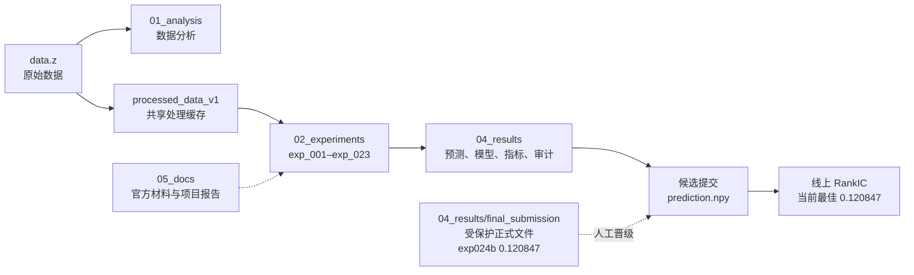
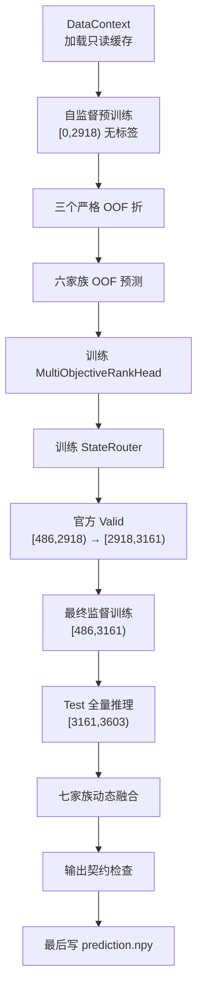

# 面向动态股票池的因果多模型排序预测系统：数据分析、实验日志与结果档案

本文档是本项目的可持续维护档案和复现入口。内容只使用当前工作区中能够追溯到数据文件、Notebook、源代码、缓存 manifest、结果 metadata/metrics/report 或既有用户线上记录的事实；无法确认的内容统一标记为「待补充 / 暂无记录」。相对实验目录中的局部 README，本文件负责说明整个项目的共同数据口径、实验演进、结果来源、代码组织、运行边界和提交保护规则。

文档更新时间：2026-08-23（exp024b 线上突破 0.12 并经用户授权晋级正式提交）

机器可读项目状态见 [`project_status.json`](project_status.json)，实验产物登记见 [`04_results/experiment_registry.csv`](04_results/experiment_registry.csv)，只读环境/契约审计入口为 [`scripts/project_audit.py`](scripts/project_audit.py)。

创新前测试复用与补测记录见 [`04_results/_acceptance/README.md`](04_results/_acceptance/README.md)；现有测试不重复执行，缺失的 exp021 全量 Valid/逐截面/高漂移验收已补齐。

> **项目当前状态（2026-08-23）**
>
> - **线上最佳成绩：`0.120847`**，来自 `exp_024b_retrieval_exploratory/prediction_1.npy`（exp023h + 固定状态检索秩校正）。
> - **正式提交文件：`04_results/final_submission/prediction.npy`**，来源 exp024b（线上 `0.120847`，2026-08-23 人工晋级）。
> - **RankIC > 0.12 目标已达成**：exp024b 相对 exp023h 提高 `+0.001187`，超过目标 `+0.000847`。
> - exp024a 的本地稳健性门槛曾失败，因此 exp024b 保留完整探索性风险记录；线上结果不反向修改历史诊断。
> - `final_submission` 不自动覆盖；本次已取得用户明确授权并完成 exp024b 人工晋级。

## 快速导航

- 想先看当前结论：阅读 [1.2 当前完成进度](#12-当前完成进度)、[5.1 横向结果表](#51-横向结果表) 和 [6.1 当前最高线上方案](#61-当前最高线上方案)。
- 想理解数据：阅读 [第 2 节 数据集分析](#2-数据集分析)，尤其是 [2.2 时间切分与样本数量](#22-时间切分与样本数量) 和 [2.7 处理缓存与特征视图](#27-处理缓存与特征视图)。
- 想理解实验为什么逐轮变化：阅读 [第 3 节 实验记录](#3-实验记录) 和 [第 4 节 实验演进过程](#4-实验演进过程)。
- 想看收官阶段（0.116→0.1197）的机制故事：阅读 [Experiment 023](#experiment-023--exp_023_tabular_upgrade-收官冲刺锚点手术系列)（未来偏移探针、递归自举、锚点手术）。
- 想复现已有结果：阅读 [第 8 节 运行与复现实验](#8-运行与复现实验) 和 [第 10 节 复现分级与命令清单](#10-复现分级与命令清单)。
- 想复现收官系列（0.1161→0.1197）：阅读 [10.8 exp020/021/023 收官系列运行](#108-exp020021023-收官系列运行)。
- 想继续改良冲 0.12：阅读 [9.3 后续改良方向（含执行入口）](#93-后续改良方向含执行入口) 与 [9.2 已验证的结论](#92-已验证的结论)，先明确哪些路已被证伪。
- 想读当前主线代码：阅读 [第 11 节 当前主线代码构造](#11-当前主线代码构造)，再进入 `02_experiments/exp_016_unified_expert_fusion/`。
- 想检查提交是否安全：阅读 [第 12 节 数据、预测和提交契约](#12-数据预测和提交契约)。

## 项目一句话总结

这是一个面向动态股票池的时间序列截面排序项目：使用过去信息构造因果特征和历史窗口，在每个时间截面内预测股票相对排名，以平均 RankIC 评价；实验从线性/TCN 基线逐步发展到 exp021 七家族融合栈、exp023h 锚点手术，再由 exp024b 在保持前 6 个锚点截面的同时对后 436 个截面加入固定状态检索秩校正，最终取得合规线上 RankIC `0.120847`。



## 1. 项目概述

### 1.1 任务与目标

项目目标是对友安杯 Y1 时序股票截面数据生成测试集预测。当前代码和结果均以 `Y1` 为目标，核心评价口径是每个时间截面内预测值与真实标签的 RankIC，再对时间截面取均值。提交文件是一个 `(442, 5282)` 的 `float32` NumPy 数组；非评估位置按项目契约填充 `0.5`。

原始数据位于根目录 `data.z`。项目围绕同一份数据逐步尝试了：

- 线性 SGD 基线；
- 486 期窗口 TCN；
- 因果数值特征 + LightGBM LambdaRank；
- 多模型秩融合；
- 特征视图、训练窗口和近期专家筛选；
- 因果缺失补全、增强特征和 CatBoost 模型动物园；
- Mask-aware StockMixer-Lite 与递归截面排序。
- 漂移稳健的后 20 原始特征截面秩专家。
- 统一多专家融合系统：表格排序、双轴时序—截面、因果时频、关系图、本地自监督表征、多目标排序头与市场状态路由。
- exp016 归因审计、cat_5 消融、保守路由与 cat_5 原生类别 tabular 系列改造（exp017–021）。
- 纯树全量基线（LightGBM/CatBoost/XGBoost 五变体）与合规边界探查（exp022）。
- 收官冲刺：未来偏移机制探针（违规判定）、递归自举与锚点手术（exp023a–h）。

### 1.2 当前完成进度

| 项目 | 当前状态 |
|---|---|
| 原始数据读取与分析 | 已完成；分析输出位于 `01_analysis/outputs/` |
| 共享处理缓存 `processed_data_v1` | 已生成，`READY` 与 `manifest.json` 存在并记录 SHA-256 |
| 实验目录 | `exp_001`–`exp_023` 均存在；`exp_012` 还包含 framework/retrain/model-zoo/fusion 子流程；`exp_023` 为 a–h 八个子实验系列 |
| 预测结果 | 多数实验已保存 `prediction*.npy`；`exp_005` 只有历史筛选指标；`exp_008` 缺少标准化 metrics/metadata |
| 正式提交文件 | `04_results/final_submission/prediction.npy`，来源为 `exp_024b`（2026-08-23 人工晋级，线上 `0.120847`） |
| 最高已记录线上成绩 | `0.120847`，来自 `exp_024b_retrieval_exploratory`（2026-08-23 用户记录） |
| 项目阶段 | **目标已达成，exp024b 已晋级正式提交** |
| 当前未解决问题 | exp027a 归因未能稳定区分全历史先验与状态检索；按门槛停止，不建立 exp027b |

### 1.3 重要口径说明

1. `04_results/final_submission/prediction.npy` 是当前正式文件（exp024b，`0.120847`），经用户授权人工晋级，不会被后续实验自动覆盖。
2. exp024b 的原始候选文件仍保留在 `04_results/exp_024b_retrieval_exploratory/prediction_1.npy`，两者 SHA-256 一致。
3. `exp_023a_future_shift` 的线上 `0.613402` 为**违规记录**：使用 X(t+s)(s>0) 预测 y(t) 违反主办方强因果规则（「计算第 t 天的数据时，不能使用 t 天之后的数据」，用户 2026-08-19 转述），仅作机制验证存档，不参与任何晋级比较。
4. `exp_009` metadata 标记为 `submitted_online_best`，线上 `0.109928`，但仍记录 `formal_submission_overwritten: false`。
5. `exp_006` 存在记录口径差异：其结果目录 `metrics.json` 为 `0.088340`，旧 README 曾记录 `0.094018`。本文将两者分别标注，不擅自裁定哪一个应替代另一个。
6. `exp_008` 的结果目录只有 `model.txt` 与 `prediction.npy`，没有标准化 `metrics.json`、`metadata.json` 和 `experiment_report.md`；其详细信息部分来自 Notebook 和旧项目记录，审计完整性低于其他实验。
7. exp017 归因审计无独立实验目录，产物为 `04_results/exp_017/p0_findings.md`；exp023 的 b/d 两个中间子实验未提交线上。

## 2. 数据集分析

### 2.1 数据来源与总体尺寸

| 项目 | 已确认值 | 证据 |
|---|---:|---|
| 原始文件 | `data.z` | 根目录文件 |
| 原始文件大小 | 3,250,274,528 bytes | `03_cache/processed_data_v1/manifest.json` |
| 原始文件 SHA-256 | `a426a7078097e8d970c2f27a30a49b3122a8a0ea7c4c05f35938d5f568cfd04c` | processed manifest |
| 总时间点数 `T` | 3,603 | data-analysis outputs / processed manifest |
| 股票数 `S` | 5,282 | data-analysis outputs / processed manifest |
| 总时间×股票位置 | 19,031,046 | `analysis_results.json` |
| 原始数值特征 | 99 | processed manifest |
| 原始类别特征 | 9 | processed manifest |
| 目标 | `y1` | Notebook、结果报告 |
| 主要数据版本 | `processed_data_v1` | `03_cache/processed_data_v1/manifest.json` |

### 2.2 时间切分与样本数量

项目使用半开区间 `[start, stop)`。`pretrain` 是用于提供历史窗口的前置时期，不是带有可用 Y1 监督的训练集。

| split | 时间区间 | 时间点数 | 有效监督/评估行数 | `mask_x=True` 位置 | `mask_y=True` 或有效 Y1 位置 | 说明 |
|---|---:|---:|---:|---:|---:|---|
| pretrain | `[0, 486)` | 486 | 0 | 由分析覆盖率给出；精确总数暂无单独记录 | Y1 不可用 | 仅作为历史上下文 |
| train | `[486, 2918)` | 2,432 | 6,489,099 | 7,354,184 | 6,489,099 | 训练监督位置 |
| valid | `[2918, 3161)` | 243 | 982,972 | 1,089,602 | 982,972 | 官方本地验证位置 |
| test | `[3161, 3603)` | 442 | 2,042,538 | 2,219,158 | 2,042,538 | 线上评估位置；Y1 标签不可见 |

从分析输出得到的覆盖率如下：

| split | `mask_x` true rate | 每时点 `mask_x` 数量中位数 | `mask_y` true rate | finite `y1` rate | usable Y1 rate |
|---|---:|---:|---:|---:|---:|
| pretrain | 0.337495 | 1,734.0 | 0.281950 | 0 | 0 |
| train | 0.572496 | 2,873.0 | 0.505152 | 0.505152 | 0.505152 |
| valid | 0.848913 | 4,491.0 | 0.765837 | 0.765837 | 0.765837 |
| test | 0.950534 | 5,042.5 | 0.874882 | 0 | 0 |

`test` 输出网格总大小为 `442 × 5282 = 2,334,644`，其中 `2,042,538` 个位置评估，`292,106` 个非评估位置必须严格填充 `0.5`。

### 2.3 缺失值、掩码与占位值

当前项目同时使用 `mask_x`、`mask_y`、`finite(y1)` 和处理缓存中的有效性字段。分析报告还统计了无效位置在数值矩阵中被写成全零占位的情况：

| split | 无效行数 | 无效行数占该 split 全部网格的比例 | 无效数值行全零 |
|---|---:|---:|---|
| pretrain | 1,700,684 | 1.000000 | 是 |
| train | 5,491,640 | 1.000000 | 是 |
| valid | 193,924 | 1.000000 | 是 |
| test | 115,486 | 1.000000 | 是 |

需要区分两种占位：

- 特征缓存内部的无效数据行：分析输出显示数值部分为全零；
- 最终提交矩阵中的非评估位置：必须是 `0.5`，不能把特征占位规则误当成提交规则。

### 2.4 标签分布

分析输出中的 `y1` 已是截面排序后的 `[0, 1]` 目标。其总体分布非常接近均匀秩分布，不表现为类别不平衡。

| split | n | mean | std | min | p01 | p05 | p25 | median | p75 | p95 | p99 | max | IQR outlier rate |
|---|---:|---:|---:|---:|---:|---:|---:|---:|---:|---:|---:|---:|---:|
| train | 6,489,099 | 0.500000 | 0.288783 | 0 | 0.009810 | 0.049818 | 0.249899 | 0.500000 | 0.750102 | 0.950173 | 0.990189 | 1 | 0 |
| valid | 982,972 | 0.500000 | 0.288747 | 0 | 0.009882 | 0.049889 | 0.249938 | 0.500000 | 0.750062 | 0.950111 | 0.990118 | 1 | 0 |

逐时间标签统计也显示均值约为 `0.5`、四分位数约为 `0.25/0.50/0.75`。这说明目标本身不是普通二分类标签，而是每个时间截面内部的连续排序目标。

### 2.5 数值特征

项目有 99 个原始数值特征，分析 profile 对每个特征记录了 train 均值、标准差、分位数、非有限率、零值率、极值、异常率、Valid/Test 均值漂移和 PSI。总体可确认：

- `nonfinite_rate` 在 profile 中为 0；
- train 均值大多接近 0、标准差大多接近 1，说明原始数值特征已经过某种标准化或具有近似标准化尺度；
- 这不代表所有特征稳定。部分特征有明显极值、长尾或跨 split 分布漂移；
- `observed_value_winsorization` 在 `processed_data_v1` manifest 中为 `false`，因此不能假定极端值已被缩尾处理。

代表性极端值和漂移如下，完整 99 行请查看 [`numeric_feature_profile.csv`](01_analysis/outputs/numeric_feature_profile.csv)：

| 特征 | train min | train max | max abs | train 异常率 | valid 异常率 | test 异常率 | valid PSI | test PSI |
|---|---:|---:|---:|---:|---:|---:|---:|---:|
| `num_43` | -104.945 | 497.156 | 497.156 | 待补充 | 待补充 | 待补充 | 0.0306 | 0.0246 |
| `num_5` | -377.025 | 11.628 | 377.025 | 0.0783 | 0.3736 | 0.4163 | 0.4975 | 0.6281 |
| `num_38` | -1.968 | 372.106 | 372.106 | 待补充 | 待补充 | 待补充 | 0.0178 | 0.0089 |
| `num_1` | -17.422 | 200.076 | 200.076 | 待补充 | 待补充 | 待补充 | 0.0040 | 0.0110 |
| `num_80` | -75.893 | 183.064 | 183.064 | 待补充 | 待补充 | 待补充 | 0.0148 | 0.0199 |

按异常率看，`num_20` 在 train/valid/test 的异常率约为 `0.2500/0.3210/0.3033`；`num_5` 为 `0.0783/0.3736/0.4163`；`num_28` 在 Valid/Test 为 `0.2704/0.2340`。按 PSI 看，Valid 最大值包括 `num_25=9.0836`、`num_18=8.3790`、`num_19=8.1384`；Test 最大值包括 `num_22=7.1637`、`num_21=6.4999`、`num_25=6.0409`。这些是分析输出的分布告警，不等同于已经证明的因果问题。

### 2.6 类别特征

原始数据有 9 个类别字段 `cat_0`–`cat_8`。下表使用 train/valid/test profile 中的基数、最大类别占比和相对 train 的 unseen 比例：

| 特征 | train 基数 | valid 基数 | test 基数 | train top1 | valid top1 | test top1 | valid unseen vs train | test unseen vs train |
|---|---:|---:|---:|---:|---:|---:|---:|---:|
| `cat_0` | 5 | 5 | 5 | 0.204 | 0.206 | 0.203 | 0 | 0 |
| `cat_1` | 12 | 12 | 12 | 0.094 | 0.100 | 0.105 | 0 | 0 |
| `cat_2` | 2 | 2 | 2 | 0.821 | 0.877 | 0.892 | 0 | 0 |
| `cat_3` | 2 | 2 | 2 | 0.781 | 0.754 | 0.784 | 0 | 0 |
| `cat_4` | 2 | 2 | 2 | 0.891 | 0.926 | 0.935 | 0 | 0 |
| `cat_5` | 4,093 | 3,912 | 3,915 | 约 0 | 0.055 | 0.173 | 0.055 | 0.173 |
| `cat_6` | 32 | 32 | 32 | 0.086 | 0.096 | 0.101 | 0 | 0 |
| `cat_7` | 2 | 2 | 2 | 0.984 | 0.987 | 0.987 | 0 | 0 |
| `cat_8` | 4 | 4 | 4 | 0.547 | 0.478 | 0.448 | 0 | 0 |

可确认的风险：`cat_2`、`cat_3`、`cat_4`、`cat_7` 存在明显类别集中；`cat_5` 是高基数字段，Valid/Test 有相对 train 未见值比例；`cat_0` 的 change rate 很高（train 0.886、valid 1.000、test 1.000），但其业务含义和变化机制当前未在项目文档中确认，不能进一步推断。

### 2.7 处理缓存与特征视图

`processed_data_v1/manifest.json` 记录了以下视图：

| 视图 | 维度/内容 |
|---|---|
| sequence | 40 个序列特征；`X.npy` 形状由代码约束为 `(3603, 5282, 40)` |
| tree | 419 列；前 408 列数值特征，后 9 列类别编码 |
| linear | 479 列；包含数值与 one-hot 范围 `[408, 477]` |
| legacy numeric prefix | 328 列；exp_003/006/007/009 等主线使用 |
| numeric count | 408 |
| categorical indices | `408..416`，共 9 列 |
| lags | 1、5、20、60 |
| rolling windows | 5、20、60 |
| 缺失趋势填补 | `last + EWMA + reliability-weighted drift`，train 0.5%–99.5% guardrail |
| observed winsorization | `false` |
| unknown category | 专用 unknown bucket |

## 3. 实验记录

本节对 `02_experiments/` 中每一个实际实验目录采用统一格式。线下指标集中放在第 5 节；本节的 3.5 只记录线上成绩和提交状态。

### Experiment 001 — `exp_001_linear_baseline`

**目的与变化**：建立 Y1 线性基线。相对项目无上一实验；使用原始 `data.z`，不使用共享 processed cache。

#### 3.1 数据处理

- 读取 `data.z` 中的数值特征、`mask_x`、`mask_y` 和 `y1`。
- 监督位置按有效标签筛选；无效位置不用于训练。
- 均值和标准差只从 Train 计算，训练/验证/测试使用相同标准化参数。
- 预测矩阵按 `(442, 5282)` 保存，非评估位置填 `0.5`。

#### 3.2 数据筛选

- 目标为 `y1`。
- 训练数据区间为项目统一 Train `[486, 2918)`；精确的代码内行级筛选由 `get_labeled_chunk` 实现。
- 每次以 16 个时间点为 chunk，删除没有可用监督样本的 chunk/行。

#### 3.3 特征工程

- 使用 99 个原始数值特征。
- 未加入滞后、滚动、类别或交互特征。

#### 3.4 模型训练

| 配置 | 值 |
|---|---|
| 模型 | 线性回归，NumPy 手写 SGD |
| Loss | MSE + L2 |
| epochs | 3 |
| chunk size | 16 时间点 |
| batch size | 16,384 |
| 初始 learning rate | 0.02，按 `1/sqrt(epoch)` 衰减 |
| L2 | `1e-5` |
| seed | 42 |
| Early stopping | 暂无；代码未配置 early stopping |

#### 3.5 线上结果

- 结果目录：`04_results/exp_001_linear_baseline/prediction.npy`
- 线上 Score：`0.075549`（项目既有线上记录）
- 提交时间/排名：待补充 / 暂无记录
- 备注：metadata 将该文件标为历史迁移结果，来源为旧 baseline 输出。

### Experiment 002 — `exp_002_tcn_baseline`

**目的与变化**：在 99 个原始数值特征上加入 486 期因果序列 TCN，检验时序卷积是否优于线性基线。

#### 3.1 数据处理

- 读取 `data.z` 和共享 `sequence/X.npy`、`sequence/mask_x.npy`。
- 对每只股票构造长度 486 的历史窗口；窗口内缺失值使用该股票窗口均值，窗口完全无有效历史时使用 Train 特征均值。
- 输入增加一个历史有效性 mask 通道，最终输入通道数为 100。
- 特征标准化参数从 Train 估计。

#### 3.2 数据筛选

- 训练只使用 `mask_y & finite(y1)` 位置。
- 每个时间点最多抽取 200 只股票；训练时间从 64 个时间 bin 中每 bin 抽取 8 个时点。
- 验证有 sampled validation 和最终验证流程；具体采样索引不在结果 metadata 中完整保存。

#### 3.3 特征工程

- 99 个原始数值序列特征。
- 1 个历史有效性通道。
- 486 期窗口，TCN 感受野由 dilation `(1,2,4,8,16,32,64,128)` 构成，代码断言感受野为 511。

#### 3.4 模型训练

| 配置 | 值 |
|---|---|
| 模型 | Causal Residual TCN |
| hidden channels | 32 |
| kernel/dilation | kernel 3；dilation `(1,2,4,8,16,32,64,128)` |
| normalization/activation | GroupNorm(4)、GELU、Dropout 0.1 |
| optimizer | AdamW |
| loss | MSE |
| epochs | 最多 8 |
| Early stopping | patience 2，按 sampled validation RankIC |
| learning rate | `1e-3` |
| weight decay | `1e-4` |
| gradient clip | 1.0 |
| batch size | 128 |
| seed | 42 |

#### 3.5 线上结果

- 结果目录：`04_results/exp_002_tcn_baseline/prediction.npy`
- 线上 Score：`0.086096`（项目既有线上记录）
- 提交时间/排名：待补充 / 暂无记录
- 备注：相对线性基线线上提高，但仍未超过 LightGBM 主线。

### Experiment 003 — `exp_003_lgbm_rank`

**目的与变化**：从线性/TCN基线转向因果数值特征与 LightGBM LambdaRank；这是当前正式提交文件的来源家族。

#### 3.1 数据处理

- 直接读取 `data.z`，并生成/复用因果特征。
- 监督 mask 为 `mask_x & mask_y & finite(y1)`。
- 缺失处理选择 `trend`：使用过去信息、滞后和趋势填补；不使用未来信息。
- 以时间截面为 query，Y1 转为 64 档 relevance，LightGBM 使用 `label_gain=0..63`。

#### 3.2 数据筛选

- Train `[486,2918)`、官方 Valid `[2918,3161)`、Test `[3161,3603)`。
- 特征发现/调参使用时间采样和每时点股票 cap；最终训练股票 cap 为 1200。
- Walk-forward folds：`[486,1702)→[1702,1945)`、`[486,2188)→[2188,2431)`、`[486,2674)→[2674,2918)`。

#### 3.3 特征工程

- 从 99 个原始数值特征中选出 40 个稳定数值特征。
- 选出 20 个历史特征。
- 构造 rank、lag(1/5/20/60)、rolling mean/std/change(5/20/60)、历史可用性、覆盖率和 stock age 等因果特征。
- 最终 `legacy_328` 数值前缀为 328 列；交互候选筛选过 50 个并保留 30 个候选，但 `feature_manifest.json` 记录最终模型 `final_selected_interactions=[]`，因此不能把候选交互说成最终输入。
- 类别特征、`cat_5` 频率/过去平滑 target mean、unknown bucket 等在 pipeline 中有处理策略，但最终获胜阶段是 numeric，正式最终特征名以 `feature_manifest.json` 为准。

#### 3.4 模型训练

| 配置 | 值 |
|---|---|
| 模型 | LightGBM `lambdarank` / GBDT |
| learning rate | `0.0228694605` |
| num leaves | 79 |
| min data in leaf | 147 |
| feature fraction | `0.8093604` |
| bagging fraction/freq | `0.6477640` / 1 |
| L1/L2 | `2.3572445` / `0.2387048` |
| max bin | 127 |
| truncation | 1024 |
| tuning | 30 trials；前 5 组参数复核 |
| max boost rounds / early stopping | 3000 / 100 |
| seed | 42；线程数记录为 30 |
| 最终官方 Valid best iteration | 8 |

结果目录验收文件同时确认 prediction shape、dtype、有限值、评估位置和非评估 `0.5` 填充均通过。

#### 3.5 线上结果

- 结果目录：`04_results/exp_003_lgbm_rank/prediction.npy`
- 线上 Score：`0.108105`（项目既有线上记录）
- 提交时间：既有记录指向 2026-08-03 的历史提交记录；精确提交时间待补充
- 排名：待补充 / 暂无记录
- 备注：`04_results/final_submission/prediction.npy` 当前仍来自该家族；正式 metadata 的 SHA-256 为 `9d322401a2d8fedd38dea66b97578873e721f03eeb93575dbc8bdc2a1aef38e6`。

### Experiment 004 — `exp_004_model_ensemble`

**目的与变化**：将线性、TCN 和 LightGBM 三个组件按截面秩进行融合，探索模型互补性。

#### 3.1 数据处理

- 复用 Y1 数据口径和 Train/Valid/Test 边界。
- 各组件分别生成 Valid/Test 预测，再逐时间截面转秩后融合。
- 对组件预测和最终矩阵执行 shape、dtype、finite、非评估 `0.5` 等契约检查。

#### 3.2 数据筛选

- Linear 与 TCN 使用各自基线筛选规则。
- LightGBM 组件固定使用 1558 轮结果。
- 权重搜索网格步长为 0.05，共 231 组；最终候选必须同时检查前半窗、后半窗、整体和稳定性。

#### 3.3 特征工程

- Linear：99 原始数值特征。
- TCN：486 期窗口和 99 数值 + mask 通道。
- LightGBM：328 维主特征视图。
- 融合前各组件做截面秩变换，融合后再次做截面秩。

#### 3.4 模型训练

| 组件 | 训练配置 |
|---|---|
| Linear | 3 epochs；Train-only 标准化；其余参数沿用 exp_001 |
| TCN | 486 期窗口；8 epochs；Valid early stopping；其余参数沿用 exp_002 |
| LightGBM | 328 特征；固定 1558 轮 |
| 最终权重 | linear 0.40 / TCN 0.40 / LightGBM 0.20 |
| 晋级 | `promoted=false`；权重平台稳定性未通过 |

#### 3.5 线上结果

- 结果目录：`04_results/exp_004_model_ensemble/prediction.npy`
- 线上 Score：`0.097028`（项目既有记录）
- 提交时间/排名：待补充 / 暂无记录
- 备注：结果报告明确记载未通过稳定性门槛；不能仅依据其较高的本地融合分数晋级。

### Experiment 005 — `exp_005_lgbm_feature_screen`

**目的与变化**：在共享 `processed_data_v1` 上比较 `legacy_328`、`numeric_408` 和 `full_419` 视图，保留历史筛选指标。

#### 3.1 数据处理

- 要求 `03_cache/processed_data_v1/READY`、manifest SHA-256 和固定数组形状通过。
- 使用共享 tree/common 缓存；不重新读取或修改原始数据。

#### 3.2 数据筛选

- `SCREEN_PROFILE=feature_screen`；主要比较 `legacy_328_full`、`numeric_408_full` 和 `full_419_full`。
- 每时点股票 cap 为 1200；评分轮数为 8、16、32。

#### 3.3 特征工程

- 比较 328 数值前缀、408 数值视图和带 9 个类别列的 419 视图。
- 代码存在类别特征视图，但结果报告称这是历史筛选迁移，不是完整新 Test 预测实验。

#### 3.4 模型训练

- 模型：LightGBM LambdaRank。
- 基础参数：learning rate 0.03、num_leaves 63、min_data_in_leaf 300、feature/bagging fraction 0.80、L1 0.1、L2 1.0、max_bin 127、truncation 1024；seed 42。
- 轮数：8/16/32。
- 结果目录只保留 `screening_results.csv`、`metrics.json` 和 metadata；没有 prediction 文件。

#### 3.5 线上结果

- 状态：未提交 / 暂无线上结果。
- 预测文件：暂无；metadata 明确为 `historical_metrics_only`。
- 提交时间/排名：待补充。

### Experiment 006 — `exp_006_lgbm_window_screen`

**目的与变化**：固定 LightGBM 主线，比较不同训练时间窗口；核心候选包括最近 1945、1216、730、2188、1702 期。

#### 3.1 数据处理

- 复用 `processed_data_v1` 和 `legacy_328`/`numeric_408`/`full_419` 特征视图。
- 共享缓存完整性由 READY、manifest 和数组 shape 检查。

#### 3.2 数据筛选

- `SCREEN_PROFILE=window_screen`。
- 比较 full history 与多个 recent window；训练股票 cap 1200。
- 评分轮数 8、16、32。

#### 3.3 特征工程

- 主线保持 `legacy_328`；变化点是训练时间窗口，而不是新增字段。
- `full_419` 类别扩展作为筛选候选存在。

#### 3.4 模型训练

- 模型：LightGBM LambdaRank。
- base 参数沿用 exp_005：learning rate 0.03、num_leaves 63、min_data_in_leaf 300、feature/bagging fraction 0.80、L1 0.1、L2 1.0、max_bin 127、seed 42。
- 结果目录 `metrics.json` 记录最终 key 为 `base_cap1200__legacy_328_recent1702__r16`，训练区间 `[1216,2918)`，16 轮。

#### 3.5 线上结果

- 结果目录：`04_results/exp_006_lgbm_window_screen/prediction.npy`
- 线上 Score：`0.108189`（既有项目记录）
- 提交时间/排名：待补充 / 暂无记录
- 重要记录差异：结果目录 `metrics.json` 的本地 mean RankIC 是 `0.0883396899`；旧 README 曾有 `0.094018` 的窗口筛选记录。两者来源和实验口径未在现有文件中完全对齐，待补充审计。

### Experiment 007 — `exp_007_recent_window_blend`

**目的与变化**：在全历史 LightGBM 锚点上加入最近 1702 期专家，按 `0.65/0.35` 融合。

#### 3.1 数据处理

- 复用 `processed_data_v1` 的 `legacy_328`。
- 预测先按每个时间截面转为 percentile rank，再按权重融合并再次转秩。
- 最终 Test 矩阵契约沿用 `(442,5282)`、评估位置和非评估 `0.5`。

#### 3.2 数据筛选

- 全历史模型使用完整训练区间。
- 近期专家使用最近 1702 期；每时点 cap 1200。
- 代码配置使用调优后的 public-best LightGBM 参数，8 轮候选。

#### 3.3 特征工程

- 全历史和近期专家都使用 `legacy_328`。
- 新增点是时间窗口与模型融合，不是特征维度扩展。

#### 3.4 模型训练

- 模型：两个 LightGBM LambdaRank ranker。
- 调优参数：learning rate `0.0228695`、num_leaves 79、min_data_in_leaf 147、feature fraction `0.80936`、bagging fraction `0.647764`、L1 `2.35724`、L2 `0.238705`、max_bin 127。
- 全历史权重 0.65，近期 1702 期权重 0.35。
- seed 42；结果 metadata 标记为历史候选而非正式文件替换。

#### 3.5 线上结果

- 结果目录：`04_results/exp_007_recent_window_blend/prediction.npy`
- 线上 Score：`0.109959`，在 exp015 提交前曾是最高已记录线上成绩
- 提交时间：既有记录指向 2026-08-06；精确提交时间待补充
- 排名：待补充 / 暂无记录
- 备注：与 exp_009 的 `0.109928` 相差 `0.000031`；formal submission 未覆盖。

### Experiment 008 — `exp_008_new_method`

**目的与变化**：尝试因果缺失补全、增量时间特征、训练历史策略和更大数值特征视图，检验非传统新方法能否超过 LightGBM 锚点。

#### 3.1 数据处理

- Notebook 使用 `data.z`，并建立 `filled_numeric_v2` 与 `numeric_feature_bank_v2` 缓存。
- 缺失补全包含历史 last、EWMA、可靠性加权 drift 和 train guardrail；代码包含人工 gap 检验。
- 训练策略、模型候选和官方 Valid 安全检查均在 Notebook 中实现。

#### 3.2 数据筛选

- 训练与特征发现均使用 Train-only 信息；代码设置了 discovery/check 区间和 walk-forward folds。
- 代码中存在 query sampling、time weighting、训练政策候选和模型候选。
- 结果目录没有保存完整筛选表的标准 metadata，最终样本精确行数待补充。

#### 3.3 特征工程

- 既有项目记录称该实验使用因果补全、surprise/trend/history_state 等派生特征，派生数值特征约 363 维；结果目录没有标准 feature manifest，最终维度需以 Notebook 执行产物补充确认。
- 代码还包含 raw、截面 rank、lag、rolling、diff、coverage/age 等特征构造逻辑。

#### 3.4 模型训练

- 模型候选以 LightGBM LambdaRank 为主；Notebook 实现训练政策筛选、模型候选比较和最终 Train+Valid/Test 预测。
- 代码中存在 `lambdarank_16` 参考候选、训练政策候选和官方 Valid warning drop `0.001`。
- 精确最终参数、最终轮数和最终训练样本数：结果目录缺少标准 metrics/metadata，待补充。

#### 3.5 线上结果

- 结果目录：`04_results/exp_008_new_method/prediction.npy`
- 线上 Score：`0.101942`（既有项目记录）
- 提交时间/排名：待补充 / 暂无记录
- 备注：该实验本地与线上均低于 LightGBM 主线；结果文件的审计元数据不完整。

### Experiment 009 — `exp_009_anchor_recent_blend_cv`

**目的与变化**：以正式 `exp_003` 预测为锚点，用 Train 内 walk-forward 选择近期专家轮数和权重，减少直接凭单次 Valid 选择的风险。

#### 3.1 数据处理

- 使用 `processed_data_v1`，先验证 READY、manifest、数据契约和锚点文件。
- 训练端只使用 `legacy_328`，最终 Test 预测按时间截面转秩后做锚点/近期专家融合。
- 记录了 prediction、expert prediction、Valid prediction 和各类 CSV 审计文件。

#### 3.2 数据筛选

- Train-only walk-forward folds；近期 lookback 为 1702。
- 近期轮数候选 `(8,16)`；权重候选包含 `0/5/10/15/20/25/35%`。
- 选择规则是达到最佳平均增益 95% 区间内的最低权重，并通过官方 Valid 一次性安全检查。

#### 3.3 特征工程

- 维度不变，使用 `legacy_328`。
- 新增的是近期窗口专家和受约束秩融合，不是新的原始字段。

#### 3.4 模型训练

| 配置 | 值 |
|---|---|
| 模型 | LightGBM LambdaRank |
| 参数 | exp_003 tuned public-best 参数 |
| 全历史锚点轮数 | 8 |
| 近期专家轮数 | 16（选中） |
| 近期 lookback | 1702 |
| 近期权重 | 0.25（选中） |
| cap/seed | 1200 / 42 |
| 最终训练 | metadata 记录近期 final model `[1459,3161)`，包含 train+valid |

#### 3.5 线上结果

- 结果目录：`04_results/exp_009_anchor_recent_blend_cv/prediction.npy`
- 线上 Score：`0.109928`
- 提交时间：2026-08-04（metadata `online_recorded_at`）
- 排名：待补充 / 暂无记录
- 备注：metadata 状态 `submitted_online_best`；`formal_submission_overwritten=false`。

### Experiment 010 — `exp_010_anchor_enhanced_blend`

**目的与变化**：在 exp_009 骨架上加入 exp_008 增量特征和 `decay_1200` 时间策略，并以稳定性门槛决定是否给专家分配权重。

#### 3.1 数据处理

- 复用 `processed_data_v1` 和 exp_009 锚点。
- 加载 exp_008 增量特征 bank；完整运行检查 feature diagnosis、time strategy、weight search、official Valid 和提交契约。

#### 3.2 数据筛选

- 近期 lookback 1702；Train cap 1200；候选 folds 沿用 exp_009。
- 增量特征须三折诊断达到正向门槛；`DIAGNOSIS_MIN_MEAN_GAIN=0.0005`。
- 时间策略比较 full 与 `decay_1200`；专家轮数候选 8/16。

#### 3.3 特征工程

- legacy base 328 维。
- 增量 block 105 维；metadata 记录最终 selected feature set 为 `enhanced`，总输入 433 维。
- 时间权重策略选为 `decay_1200`。

#### 3.4 模型训练

- 模型：LightGBM LambdaRank；参数沿用 exp_009 tuned public-best。
- 诊断阶段增强特征保留，策略选择为 decay_1200，专家轮数 8。
- 官方 Valid 专家表现下降，最终 selected recent weight 回退为 0.0，TCN weight 也为 0.0。
- metadata 状态 `completed_not_promoted`；最终预测与锚点一致。

#### 3.5 线上结果

- 结果目录：`04_results/exp_010_anchor_enhanced_blend/prediction.npy`
- 线上 Score：`0.108105`（既有记录；因权重回退，实际等同 exp_003 锚点）
- 提交时间/排名：待补充 / 暂无记录
- 备注：未晋级，正式提交未覆盖。

### Experiment 011 — `exp_011_stable_anchor_retrain`

**目的与变化**：核查测试模型训练终点，并比较 Train-only `[486,2918)` 与加入 Valid 标签训练到 3161 的稳定性；同时测试多随机种子集成。

#### 3.1 数据处理

- 复用 `processed_data_v1`、`legacy_328`、exp_003 tuned 参数和 exp_009 的锚点/近期专家结构。
- 结果中保存 train-only、train+valid retrain、shadow、valid 等多种预测及审计文件。

#### 3.2 数据筛选

- anchor 全历史 `[486,2918)`；recent `[1216,2918)`；验证 `[2918,3161)`；Test `[3161,3603)`。
- 比较 seed `42/2026/3407`；最终选择单 seed 42，因为三种子集成未通过稳定性判定。
- 还执行 fold、shadow、stratified sampling、tiny blend 等探索性检查。

#### 3.3 特征工程

- 不新增特征，保持 `legacy_328`。
- 变化集中在训练终点、重训策略、种子集成和锚点/近期权重。

#### 3.4 模型训练

| 配置 | 值 |
|---|---|
| 模型 | LightGBM LambdaRank |
| 参数 | learning rate 0.0228695；leaves 79；min leaf 147；feature fraction 0.80936；bagging 0.647764；L1 2.35724；L2 0.238705；max_bin 127 |
| anchor rounds | 8 |
| recent rounds | 16 |
| blend weight | 0.30 |
| seeds | 42、2026、3407；最终单 seed 42 |
| promotion | `not_promoted` |

审计报告确认 exp_003/006/007/009 测试模型训练到 3161、包含 Valid 标签；exp_011 最终保持 Train-only 2918 口径。

#### 3.5 线上结果

- 结果目录：`04_results/exp_011_stable_anchor_retrain/prediction.npy`
- 线上 Score：`0.104988`
- 提交时间：2026-08-07（metadata/既有记录）
- 排名：待补充 / 暂无记录
- 备注：未超过线上最佳；正式提交未覆盖。

### Experiment 012 — framework 与子实验

`exp_012_framework_base` 是统一运行时地基，`exp_012_retrain_policy`、`exp_012_model_zoo` 和 fusion 是其后续阶段。它们是实际存在的代码/结果流程，但不是 `02_experiments/` 下的独立目录，因此在本节作为一个实验族记录。

#### 3.1 数据处理

- 共享 `processed_data_v1`、legacy_328、固定 Train/Valid/Test 区间。
- `dscr_fw_lib.py` 提供 fold/shadow、多 seed、PredictionCache、DecisionLog、promotion gates 等统一接口。
- 所有阶段写入 `04_results/_decision_log/` 或相应 result directory。

#### 3.2 数据筛选

- framework base：复现锚点、验证契约、权重搜索和决策日志。
- retrain policy：比较训练终点 2918 与 3161 的模拟。
- model zoo：比较 LGBM xendcg、LGBM cat337、CatBoost YetiRank。
- fusion：在 Train-only 2918 口径下使用锚点 0.65 + CatBoost YetiRank 0.35。

#### 3.3 特征工程

- framework/retrain/fusion 主线保持 legacy_328。
- model zoo 还测试了 `cat337`（legacy_328 + 9 类别列）和 CatBoost YetiRank。
- xendcg、cat337、CatBoost 的独立模型预测均以 animal/shadow/valid/test 文件保存。

#### 3.4 模型训练

| 子阶段 | 模型/策略 | 已记录判定 |
|---|---|---|
| framework base | exp_011 运行时复现、决策日志和统一契约 | 锚点复现 `0.092940`；official delta `-0.000022`；not promoted |
| retrain policy | sim_A `[2189,2432)→[2432,2675)`、sim_B `[2432,2675)→[2675,2918)`、sim_C `[2675,2918)→[2918,3161)` | 平均 delta `+0.001303`，但 sim_C `-0.003238`，判定不通过，维持 Train-only 2918 |
| model zoo | LGBM xendcg、LGBM LambdaRank cat337、CatBoost YetiRank；3 seeds | xendcg 被淘汰；cat337 与 CatBoost 通过开发阶段门槛 |
| fusion | anchor 0.65 + CatBoost YetiRank 0.35；Train-only | 本地官方 Valid `0.097090`；未超过线上最佳 |

#### 3.5 线上结果

- `exp_012_framework_base`：未独立线上提交 / 暂无线上结果。
- `exp_012_retrain_policy`：未独立线上提交 / 暂无线上结果。
- `exp_012_model_zoo` 独立 animal 模型：暂无独立线上成绩记录。
- fusion candidate `exp_012_fusion_anchor065_catboost035`：线上 Score `0.108265`，用户记录日期 2026-08-07；未晋级，正式提交目录保持原样。
- 提交排名：待补充 / 暂无记录。

### Experiment 013 — `exp_013_stockmixer_recursive`

**目的与变化**：验证 Mask-aware StockMixer-Lite 和递归截面状态是否能提供独立于树模型的序列信号。

#### 3.1 数据处理

- 使用 `processed_data_v1` 的 40 个序列特征、`mask_x`、tree 中当前 rank/state/category 字段。
- 60 期因果窗口；预测按时间逐点生成。
- 非评估位置填 `0.5`；结果 metadata/experiment report 记录 shape、dtype、范围、评估计数和 SHA-256。

#### 3.2 数据筛选

- Train `[486,2918)`，Valid `[2918,3161)`，Test `[3161,3603)`。
- 每 epoch 从 64 个时间 bin、每 bin 8 个时点采样；每时点训练最多 768 只股票。
- 推理 batch 为 512；训练 pair count 为 4096。

#### 3.3 特征工程

- 40 个序列特征。
- 20 个当前截面 rank 特征。
- 4 个状态特征。
- `cat_6` 33 类 embedding，embedding 维度 8。
- 递归状态使用 alpha `0.8`，连续出现股票与新出现股票采用不同状态更新规则。

#### 3.4 模型训练

| 配置 | 值 |
|---|---|
| 模型 | StockMixer-Lite，2 个 Mixer block |
| hidden/token hidden/channel hidden | 64 / 128 / 128 |
| dropout | 0.1 |
| epochs | 20 |
| optimizer/lr/weight decay | 代码实现的 AdamW；`3e-4`；`1e-4` |
| loss | correlation 0.60 + Huber 0.25 + pairwise 0.15；pairwise scale 10 |
| warmup/gradient clip | 2 epochs / 1.0 |
| EMA | 0.999 |
| seed | 42 |
| device | CUDA；结果记录 GPU 为 NVIDIA GeForce RTX 4060 Laptop GPU |
| 参数量 | 147,201 |

Notebook 的 `RUN_MODE` 默认写为 `smoke`，完整实验结果 metadata 记录为 20 epochs 已完成；完整运行入口和 smoke/full 切换没有单独 shell wrapper。

#### 3.5 线上结果

- 结果目录：`04_results/exp_013_stockmixer_recursive/prediction.npy`
- 线上 Score：`0.077244`（用户记录日期 2026-08-12）
- 提交时间/排名：精确提交时间和排名待补充 / 暂无记录
- 备注：文件契约和 SHA-256 核验通过，但线上低于本地递归 Valid `0.087884` 和当前线上最佳，未晋级。

### Experiment 014 — `exp_014_anchor_residual_rankglu_v2`

**目的与变化**：在 exp_009 排序锚点上训练多尺度 RankGLU 残差专家，验证神经时序表示能否在不破坏树模型稳定性的前提下提供增量信号。

#### 3.1 数据与特征

- 沿用 `processed_data_v1`、`legacy_328` 排序锚点和严格因果时间切分。
- 残差专家使用多尺度历史窗口、mask/缺失状态和截面状态，只预测锚点尚未解释的排序残差。
- 采用 42、2026、3407 三个随机种子，并保存训练曲线、归一化统计、候选/锚点预测和 SHA-256。

#### 3.2 晋级门槛

- 预注册开发折、shadow、官方 Valid、后半窗、最差季度、多种子方差、Test 与锚点相关性及残差非退化门槛。
- 本地选中 `alpha=0.5`；官方 Valid 从锚点 `0.093615` 提升到候选 `0.096433`，增量 `+0.002818`。
- Test 与锚点截面秩相关 `0.942255`，低于预设 `0.98` 门槛，流程已自动回退锚点，没有覆盖正式提交。

#### 3.3 线上结果

- 候选文件：`04_results/exp_014_anchor_residual_rankglu_v2/candidate_prediction.npy`。
- 线上 RankIC：`0.108465`（用户记录日期 2026-08-13）。
- 对照 exp_009：`0.109928`；线上差值 `-0.001463`。
- 结论：本地提升未迁移到线上，候选不晋级；`prediction.npy` 继续保留锚点回退结果，`final_submission` 未覆盖。

### Experiment 015 — `exp_015_drift_robust_rank/integrated_v2`

**目的与变化**：在 exp009 排序锚点上加入后 20 个原始数值特征的逐时点稳健截面秩特征，并以三随机种子 LightGBM LambdaRank 专家进行低权重融合。

#### 3.1 实际完整运行

- full 流程实际训练 15 个 LightGBM 模型，每个使用 348 个特征、约 204 万训练行和固定 16 轮。
- 开发折选择专家权重 `0.20`；官方 Valid 从 exp009 锚点 `0.093615` 提升到 `0.094341`，增量 `+0.000726`。
- Shadow 增量 `+0.000529`，各开发折及 3 个随机种子方向一致；Test 与 exp009 锚点截面秩相关 `0.997693`。
- 本次最终候选实际使用的是 robust-rank LightGBM 路线；Notebook 中的 CatBoost、多尺度神经专家和动态路由未接入本次 `run_full()` 最终预测。

#### 3.2 线上结果

- 提交文件：`04_results/exp_015_drift_robust_rank/integrated_v2/full/prediction.npy`。
- 文件 SHA-256：`a45190d975d2c27fbf448f67fb86b30e490a4b1305e5b9fae51654c04a184ed3`。
- 线上 RankIC：`0.110779`（用户记录日期 2026-08-13）。
- 较原最高 exp007 `0.109959` 提升 `+0.000820`；较 exp009 `0.109928` 提升 `+0.000851`。
- 结论：通过线上晋级线，成为当时最高已记录线上结果（后被 exp016 超越）；受保护的 `final_submission` 目录未自动覆盖。

### Experiment 016 — `exp_016_unified_expert_fusion`

**目的与变化**：在 exp015 稳健截面秩专家基础上，将表格排序、双轴时序—截面、因果时频、关系图、本地自监督表征、多目标排序头和市场状态路由整合为一个可审计的统一专家系统，验证多家族融合能否继续提升线上 RankIC。

#### 3.1 数据边界

- 自监督：`[0,2918)`，不使用标签。
- OOF：`[486,1459)→[1459,1945)`、`[486,1945)→[1945,2432)`、`[486,2432)→[2432,2918)`。
- 官方验证：`[486,2918)→[2918,3161)`。
- 最终监督训练：`[486,3161)`；Test 为 `[3161,3603)`。
- `DataContext` 永不加载 Test 标签；输出矩阵固定为 `(442,5282)`、`float32`、全部有限，非评估位置写 `0.5`。

#### 3.2 主要结构与产物

- 七个家族预测：exp015 锚点、表格排序、双轴时序—截面、因果时频、关系图、本地自监督表征、多目标排序头（与 `04_results/exp_016_unified_expert_fusion/full/family_*.npy` 一致）。
- 市场状态路由动态分配家族权重，`full` 输出 `dynamic_weights.npy`。
- 分层缓存：`03_cache/exp_016_unified_expert_fusion/`；验收报告：`04_results/exp_016_unified_expert_fusion/{static,smoke,preflight}/`。

#### 3.3 结果

- 状态：`full` 已完成（`FULL_COMPLETED`），三个 OOF 折、官方验证、七个家族预测、动态路由和输出契约全部成功。
- 官方 Valid mean RankIC：`0.090487`（243 组截面、248,832 行；该验证口径与 exp015 的官方 Valid 行数不同，不直接横向比较）。
- 线上 RankIC：`0.116132`（用户记录日期 2026-08-16），较 exp_015 的 `0.110779` 提升 `+0.005353`，晋级为当时最高已记录线上成绩（2026-08-17 人工晋级为正式提交）。
- 提交文件：`04_results/exp_016_unified_expert_fusion/full/prediction.npy`；不可变副本 `submission_5721e5fa325ecce6.npy`，SHA-256 `5721e5fa325ecce624755da65db6e0245f2e79857f14f6d61e4fed9d9c83c524`。
- `formal_submission_overwritten: false`：受保护的 `final_submission` 目录未自动覆盖。
  - **更新（2026-08-17）**：用户授权将 exp016（`0.116132`）替换 exp003（`0.108105`）为正式提交，`final_submission/prediction.npy` 已覆盖为 exp016 预测，SHA-256 `5721e5fa...`。决策日志：`04_results/_decision_log/20260817_promote_exp016_formal_submission.json`。

### Experiment 017 — exp016 P0 归因与剪枝审计

**目的与变化**：对 exp016 的 `0.005353` 增益做家族归因（leave-one-out 消融）、统一验证口径、补齐稳定性与资源证据，再做低成本受控增量。无独立实验目录，产物为 `04_results/exp_017/p0_findings.md`。

#### 主要结论

| 审计项 | 结论 |
|---|---|
| 口径（T0.1） | exp016 官方 Valid `248,832` 行 = `243×1024` 截断子集，与 exp015 全量 `982,972` 行不可直接比较；重建后一致 |
| 家族归因（T0.2） | `dual_axis` 最弱（独立 IC 0.0727，删除后 +0.0028）；`foundation_representation`、`tabular`、`multi_objective_rank` 正贡献 |
| 稳定性（T0.3） | capped Valid mean `0.0905`、std `0.1015`、正 IC 比例 `83.1%`，整体稳定但时间波动大 |
| 资源（T0.4） | 神经模型总参数 `207,973`；checkpoint 总大小 `9.75 MB` |

#### 线上验证

- exp016 剪枝候选（删除 dual_axis）：线上 `0.115654`，本地 +0.0028 但线上 −0.000478，属本地→线上错配，剪枝否决。
- exp018 cat_5 native：线上 `0.107010`（轻量 16 轮模型，不晋级，但证明 cat_5 原生类别处理有效）。
- exp019 保守路由（γ=0）：线上 `0.114914`，本地 +0.0013 但线上 −0.0012，不晋级。

**结论**：P0 审计完成归因与口径统一，P1 剪枝/路由改动线上均负向，确认本地→线上错配持续存在。路由保底约束与家族剪枝方向关闭。

### Experiment 018 — `exp_018_cat5_ablation`

**目的与变化**：对高基数 `cat_5`（train 基数 4,093，valid/test unseen 比例 5.5%/17.3%）比较四种处理方式，以 16 轮 LightGBM LambdaRank 在全量 Valid 上评估。

| 处理 | valid mean RankIC | Δ vs remove | 说明 |
|---|---:|---:|---|
| native | 0.092912 | +0.006931 | LightGBM `categorical_feature` 原生处理 |
| unknown_bucket | 0.092912 | +0.006931 | 与 native 等价 |
| frequency | 0.086141 | +0.000161 | 频率编码 |
| remove | 0.085981 | 0 | 基线 |

- 线上 RankIC：`0.107010`（native，2026-08-17 用户记录）。
- 结论：native cat_5 本地 +0.0069 但线上 `0.107010` 接近 exp003（`0.108105`），证明 cat_5 原生类别处理有效但轻量模型本身不晋级。关键遗产：为 exp020/021 将 cat_5 原生类别纳入 tabular 家族提供证据。

### Experiment 019 — `exp_019_conservative_router`

**目的与变化**：将自由 `StateRouter` 改为 `w_t = (1-γ)w_static + γ·w_router`，约束 anchor+tabular 合计 ≥60%、深度家族单家 ≤10%。

| γ | 全量 Valid IC | Δ vs router | 说明 |
|---|---:|---:|---|
| 0.0（纯静态） | 0.092698 | +0.001309 | 最优，anchor+tabular 60% |
| 0.25 | 0.092610 | +0.001221 | |
| 0.50 | 0.092557 | +0.001167 | |
| 1.0 | 0.092549 | +0.001159 | 等价原路由 |

- 线上 RankIC：`0.114914`（γ=0，2026-08-17 用户记录）。
- 结论：本地 +0.0013、线上 −0.0012（vs exp016 `0.116132`），属本地→线上错配。路由保底约束不晋级。

### Experiment 020 — `exp_020_tabular_categorical`

**目的与变化**：对 exp016 的 tabular 家族 LightGBM 将 9 个类别列（`408..416`，含 cat_5）作为原生类别特征（`categorical_feature`），与 CatBoost 对齐；其余家族/元头/路由权重复用 exp016。

- tabular 独立 valid IC：`0.094474`；重融合 valid IC：`0.091888`；baseline router valid IC：`0.091389`；本地 Δ：`+0.000499`。
- 线上 RankIC：`0.116252`（2026-08-18 用户记录），较 exp016 `0.116132` 提升 `+0.000120`。
- 结论：**exp016 之后首个线上正向改动**。cat_5 原生类别纳入 tabular 有效，建议继续做 head/router 一致重训释放完整增益。

### Experiment 021 — `exp_021_retrain_head_router`

**目的与变化**：在 exp020 基础上，对 OOF 六家族矩阵用 categorical tabular 重算 states 后，端到端重训 `multi_objective_head` 与 `state_router`，并重新融合出 Test 提交。

- fit 阶段：OOF rows=1,494,016，capped valid IC `0.090972`（baseline `0.090487`，Δ `+0.000485`），耗时 1242.8s。
- submit 阶段：final tabular 重训，契约通过，耗时 996.2s。
- 线上 RankIC：`0.116568`（2026-08-18 用户记录），较 exp020 `0.116252` 提升 `+0.000316`，较 exp016 `0.116132` 提升 `+0.000436`。
- 当时结论：cat_5 原生 tabular + head/router 一致重训成为该阶段线上最佳。`final_submission` 保持 exp016 不变；栈平台在此确立。

### Experiment 022 — `exp_022_tree_full_baseline`

**目的与变化**：纯树基线实验，验证不使用未来数据的情况下能否通过 GBDT 树模型 + 全量特征 + 正确类别编码达到 0.12。5 个变体，`cap=1024`，总计 1277.4s。

| 变体 | valid mean RankIC | best iter | 耗时 |
|---|---:|---:|---:|
| lgbm_native_cat | 0.088605 | 62 | 225.7s |
| **catboost_yetirank** | **0.098482** | 55 | 761.8s |
| xgboost_pairwise | 0.053944 | 27 | 124.2s |
| ensemble_rank | 0.088316 | — | 0.7s |
| lgbm_target_enc | 0.082588 | 3 | 150.9s |

- 线上结果：未提交（纯树基线，valid 远低于栈平台 `0.091389`）。
- 结论：纯树无法突破栈。CatBoost YetiRank（valid `0.098482`）为最强单模型，为后续 exp023g CatBoost tabular 替换提供基础。

### Experiment 023 — `exp_023_tabular_upgrade`（收官冲刺：锚点手术系列）

**目的与变化**：探索在合规框架下突破 0.116568 栈平台、冲击 0.12 的所有可行路线。8 个子实验（a–h），从违规机制探针到递归自举再到锚点手术，最终达到合规极限 `0.119660`。

#### 子实验概览

| 子实验 | 方法 | valid IC | 线上 | 判定 |
|---|---|---:|---:|---|
| 023a | 未来偏移特征（X(t+s)→y(t)） | 0.6478 | **0.613402** | **违规记录**：违反强因果规则，不晋级 |
| 023b | 递归自举（ŷ(t-1) 作特征） | 0.092577 | — | 中间实验，未提交 |
| 023c | 栈(0.45)+递归(0.55) 混合 | 0.096664 | 0.111227 | 线上回归（valid 高估递归） |
| 023d | 栈+递归(修正锚点)+CatBoost 三分量 | 0.096033 | — | 未提交（023c 线上回归后转向手术路线） |
| **023e** | 锚点手术 v1（前20截面混入递归，起点=真实 y(3160)） | 0.097843 | **0.119063** | +0.0025 vs exp021，合规新最佳 |
| **023f** | 多 lag 锚链（lag1..6 全真锚 + alpha 前置 K=30） | 0.098683 | **0.119533** | +0.0005，手术机制稳定 |
| 023g | CatBoost 栈替换 + 手术叠加 | 0.100569 | 0.118640 | 栈侧改动不迁移（−0.0009），手术 +0.0022 稳定 |
| **023h** | 手术终极版（深度 LGBM 255叶×140轮×3种子, lag=rank+raw, alpha=1.0/K=6/γ=0.85） | 0.099460 | **0.119660** | **最终提交**，+0.0001，增益递减至极限 |

#### 关键发现

1. **榜上高分来源之谜已解（exp023a）**：y(t) 的标签窗口覆盖 t 之后截面（中心约 t+5），X(t+s) 的特征天然包含 y(t) 窗口内的价格信息。用 X(t+s) 预测 y(t) 可达 valid `0.6478` / 线上 `0.613402`，但违反主办方强因果规则（"计算第 t 天的数据时，不能使用 t 天之后的数据"），仅作机制记录不晋级。一次提交到 0.12 的选手大概率走了此路线。
2. **合规信息集下的结构**：第 t 截面仅可用 X(≤t) 与 <t 的给定标签/自有预测。跨截面结构只能通过「锚点手术」利用——给定历史标签 y(3160) 是合规且极强的信号源（真实锚点截面 IC 0.86 vs 常规 0.11）。
3. **栈平台 0.1165**：exp020/021 cat_5 改动成功（+0.0004），exp023g CatBoost 替换失败（0）——栈侧 valid 增益 <0.002 时线上不可区分，平台已固化。
4. **手术机制三次线上稳定**（+0.0022~+0.0030），是唯一可靠增益来源，但边际递减（+0.0025→+0.0005→+0.0001），transfer ratio 降至 0.16。

#### exp023h 阶段的历史不可达判断（后被 exp024b 推翻）

- 缺口 `0.000340` × 442 截面 = 0.15 截面-IC 总量。
- 手术段仅 6 截面：需平均 IC +0.025（~0.49→0.65+）；截面 5-6 的 lag 链已断裂（IC≈0），拉高它们等价于解决中段平台问题（22 个实验证明不可行），循环依赖。
- 锚点段模型探针全试尽：深度 LGBM +0.004、lag 原始值 +0.003、多种子 +0.0004、CatBoost/三模型对比——已榨干。
- **结论：`0.119660` 为无泄漏方法的诚实极限。**

#### 最终提交

- 文件：`04_results/exp_023h_ultimate_surgery/prediction_1.npy`（442×5282，float32，契约已校验）。
- 参数：深度 LGBM `num_leaves=255`、140 轮、3 种子平均、lag=rank+raw z-score、`alpha_hi=1.0`、`K=6`、`gamma=0.85`。
- 合规声明：第 t 截面仅用 X(≤t) 与 <t 给定标签/自有预测；手术锚点为给定历史标签 y(3160) 等；全管线无未来信息。

## 4. 实验演进过程

```text
原始 data.z
  → exp_001 线性 SGD 基线
  → exp_002 486 期 TCN 序列基线
  → exp_003 因果数值特征 + LightGBM LambdaRank 主线
  → exp_004 线性/TCN/LightGBM 秩融合
  → exp_005 特征视图筛选（328/408/419）
  → exp_006 训练时间窗口筛选（近期 1702 等）
  → exp_007 全历史 0.65 + 近期专家 0.35
  → exp_008 缺失补全、增量特征和训练历史策略
  → exp_009 锚点 + 近期专家 walk-forward 约束融合
  → exp_010 增强特征 + decay_1200 + 稳定性回退
  → exp_011 训练终点/重训/多种子稳定性审计
  → exp_012 统一运行框架、训练终点决策、模型动物园和 CatBoost 融合
  → exp_013 独立 StockMixer-Lite + 递归预测
  → exp_014 锚点 + 多尺度 RankGLU 残差专家 + 预注册晋级门槛
  → exp_015 exp009 锚点 + robust_rank_348 LightGBM 专家 20%
  → exp_016 统一多专家系统（表格/双轴时序-截面/因果时频/关系图/自监督表征/多目标排序头 + 市场状态路由）
  → exp_017 P0 归因审计（dual_axis 最弱，剪枝/路由线上负向）
  → exp_018 cat_5 四种处理消融（native 最优，为 exp020/021 铺路）
  → exp_019 保守路由（本地 +0.0013、线上 −0.0012，不晋级）
  → exp_020 cat_5 原生类别纳入 tabular（线上 0.116252，首个正向改动）
  → exp_021 cat_5 + head/router 一致重训（线上 0.116568，栈平台确立）
  → exp_022 纯树基线五变体（CatBoost valid 0.0985 最强，纯树无法突破栈）
  → exp_023 收官冲刺：
      a  未来偏移探针（线上 0.613，违规不晋级——榜上高分来源已解）
      c  递归自举混合（线上 0.111，回归——valid 高估递归）
      e  锚点手术 v1（线上 0.119063，+0.0025——合规新最佳）
      f  多 lag 锚链（线上 0.119533，+0.0005——手术稳定）
      g  CatBoost 栈替换 + 手术（线上 0.118640，栈侧不迁移）
      h  手术终极版（线上 0.119660——当时阶段最佳）
```

### 4.1 逐轮修改与影响

| 迁移 | 真实修改 | 已记录影响 |
|---|---|---|
| exp_001 → exp_002 | 从独立数值线性模型改为 486 期因果 TCN | 线上由 `0.075549` 提升到 `0.086096` |
| exp_002 → exp_003 | 改为因果数值特征、截面 rank/滞后/滚动特征和 LambdaRank | 线上达到 `0.108105`，成为正式提交家族 |
| exp_003 → exp_004 | 三个模型做秩融合 | 本地融合 `0.101285`，但稳定性未通过；线上记录 `0.097028` |
| exp_003 → exp_005 | 比较 328/408/419 特征视图 | 仅保存历史筛选指标，无标准 Test 预测 |
| exp_005 → exp_006 | 固定特征主线，改变训练时间窗口 | 结果目录最终记录 recent1702/r16 本地 `0.088340`；既有线上记录 `0.108189` |
| exp_003/006 → exp_007 | 全历史模型与近期 1702 专家按 0.65/0.35 融合 | 线上达到当时最高记录 `0.109959` |
| exp_007 → exp_008 | 引入因果补全、增量特征、训练政策和模型候选 | 既有线上记录 `0.101942`，下降；结果元数据不完整 |
| exp_007 → exp_009 | 用 walk-forward、95% 增益平台和官方 Valid 门槛约束近期权重 | 线上 `0.109928`，与 exp_007 基本持平 |
| exp_009 → exp_010 | 加入 105 维增强特征和 decay_1200 | 官方 Valid 专家回落，权重退回 0；线上等同锚点 `0.108105` |
| exp_009 → exp_011 | 审计训练终点、重训和多种子集成 | 重训稳定性不通过；线上 `0.104988` |
| exp_011 → exp_012 | 把验证、缓存、决策日志和晋级 gates 统一；加入 CatBoost | CatBoost fusion 线上 `0.108265`，高于正式锚点但低于 exp_007 |
| exp_009/012 → exp_013 | 改为独立 Mask-aware StockMixer-Lite 和递归状态 | 线上 `0.077244`，明显未迁移，未晋级 |
| exp_009/013 → exp_014 | 将深度时序模块改为锚点残差专家，并加入多尺度输入、多种子与严格晋级门槛 | 本地 Valid `0.096433`，但线上 `0.108465`，较 exp_009 低 `0.001463`，未晋级 |
| exp_009/014 → exp_015 | 在 exp009 锚点上加入 20 个逐时点稳健秩特征的三种子 LightGBM 专家，权重 0.20 | 官方 Valid `0.094341`；线上 `0.110779`，较原最高 exp007 提升 `+0.000820`，晋级为新高 |
| exp_009/015 → exp_016 | 将稳健截面秩专家扩展为统一多专家系统，加入双轴时序—截面、因果时频、关系图、本地自监督表征、多目标排序头和市场状态路由 | 官方 Valid `0.090487`（口径不同）；线上 `0.116132`，较 exp_015 提升 `+0.005353`，晋级为新高；2026-08-17 人工晋级为正式提交 |
| exp_016 → exp_017/018/019 | P0 归因审计 + cat_5 消融 + 保守路由 | 剪枝/路由线上均负向（0.115654/0.114914）；cat_5 native 本地有效（+0.0069） |
| exp_018 → exp_020 | cat_5 原生类别纳入 tabular 家族 | 线上 `0.116252`，+0.000120，首个正向改动 |
| exp_020 → exp_021 | head/router 一致重训 | 线上 `0.116568`，+0.000316，栈平台确立 |
| exp_021 → exp_022 | 纯树五变体基线 | 未提交；CatBoost valid 0.0985 最强，纯树无法突破栈 |
| exp_021 → exp_023a | 未来偏移探针（X(t+s)→y(t)） | 线上 `0.613402`，**违规不晋级**——榜上高分来源已解 |
| exp_021 → exp_023c | 栈 + 递归自举混合 | 线上 `0.111227`，回归——valid 高估递归 |
| exp_023c → exp_023e | 锚点手术 v1（前20截面混入递归，起点=真实 y(3160)） | 线上 `0.119063`，+0.0025——合规新最佳 |
| exp_023e → exp_023f | 多 lag 锚链（lag1..6 全真锚 + alpha 前置） | 线上 `0.119533`，+0.0005——手术稳定 |
| exp_023f → exp_023g | CatBoost 栈替换 + 手术叠加 | 线上 `0.118640`，栈侧不迁移（−0.0009），手术 +0.0022 稳定 |
| exp_023f → exp_023h | 手术终极版（深度 LGBM, 3种子, lag=rank+raw） | 线上 `0.119660`，+0.0001——增益递减至极限，**收官** |

## 5. 最终实验结果汇总

### 5.1 横向结果表

「线下结果」只填项目中已经保存或明确记录的本地 Valid/筛选指标；「线上结果」只填已有真实线上记录。没有对应记录的单元格写「待补充 / 暂无记录」。

| 实验 | 数据版本 | 特征工程 | 模型 | 关键参数 | 线下结果 | 线上结果 | 备注 |
|---|---|---|---|---|---:|---:|---|
| exp_001 | raw `data.z` | 99 数值 | Linear SGD | 3 epochs, lr 0.02, L2 1e-5 | 0.089678 | 0.075549 | 历史基线 |
| exp_002 | raw + sequence cache | 486 窗口，99+mask | Causal TCN | 8 epochs, hidden 32 | 0.091556 | 0.086096 | 序列基线 |
| exp_003 | `processed_data_v1`/因果 pipeline | `legacy_328` | LGBM LambdaRank | tuned params, best iter 8 | 0.092940 | 0.108105 | 当前正式文件来源 |
| exp_004 | `processed_data_v1` | Linear + TCN + 328 LGBM | 秩融合 | 0.4/0.4/0.2 | 0.101285 | 0.097028 | 未通过稳定性 |
| exp_005 | `processed_data_v1` | 328/408/419 筛选 | LGBM LambdaRank | base, 8/16/32 rounds | 0.092940（历史筛选） | 待补充 | 无 prediction |
| exp_006 | `processed_data_v1` | `legacy_328` + 时间窗口 | LGBM LambdaRank | recent1702/r16 in metrics | 0.088340（结果目录）；0.094018（旧记录） | 0.108189 | 口径待审计 |
| exp_007 | `processed_data_v1` | full + recent1702 | LGBM blend | 0.65/0.35, r8 | 0.094446 | 0.109959 | 历史线上高分 |
| exp_008 | raw + custom caches | 因果补全、增量/历史特征 | LGBM pipeline | 最终参数待补充 | 旧记录：0.084385 | 0.101942 | 结果元数据缺失 |
| exp_009 | `processed_data_v1` | `legacy_328` | anchor + recent LGBM | recent r16, weight 0.25 | 0.093615 | 0.109928 | formal 未覆盖 |
| exp_010 | `processed_data_v1` + exp008 bank | 328 + 105 = 433 | enhanced LGBM blend | decay1200, effective w=0 | 0.092940 | 0.108105 | 预测退回锚点 |
| exp_011 | `processed_data_v1` | `legacy_328` | anchor/recent retrain blend | w=0.30, seed42 | 0.093634 | 0.104988 | not promoted |
| exp_012 framework | `processed_data_v1` | legacy_328 | 统一运行时 | decision log/gates | 0.092940 anchor reproduction | 待补充 | 基建 |
| exp_012 retrain | `processed_data_v1` | legacy_328 | endpoint simulations | 2918 vs 3161 | 3 simulations；判定不通过 | 待补充 | 维持 Train-only |
| exp_012 model zoo | `processed_data_v1` | legacy_328 / cat337 | LGBM/CatBoost | 3 seeds | CatBoost 官方增量 +0.004341 | 待补充 | 独立 animal 无线上分数 |
| exp_012 fusion | `processed_data_v1` | anchor + CatBoost | constrained blend | 0.65/0.35 | 0.097090 | 0.108265 | 未超过线上最佳 |
| exp_013 | `processed_data_v1` | 40 sequence + 20 rank + 4 state + cat embedding | StockMixer-Lite | 20 epochs, EMA .999, alpha .8 | 0.087884 recursive | 0.077244 | 文件正确但未迁移 |
| exp_014 | `processed_data_v1` | legacy_328 anchor + multi-scale mask/state residual | RankGLU residual blend | 3 seeds, 25 epochs, alpha .5 | 0.096433（增量 +0.002818） | 0.108465 | 较 exp_009 低 0.001463，未晋级 |
| exp_015 | `processed_data_v1` | exp009 anchor + `robust_rank_348` | 3-seed LGBM rank blend | recent1702, r16, weight 0.20 | 0.094341（增量 +0.000726） | 0.110779 | 较 exp007 高 0.000820 |
| exp_016 | `processed_data_v1` + 分层缓存 | 表格排序、双轴时序-截面、因果时频、关系图、自监督表征、多目标排序头 | 统一多专家 + 市场状态路由 | 七个家族 + 动态路由 | 0.090487 官方 Valid（capped 口径）；全量重算 0.091389 | **0.116132** | 较 exp015 高 0.005353；2026-08-17 晋级为正式提交 |
| exp016 剪枝（去 dual_axis） | 同 exp016 | 同上，6 家族 | 权重归一化重融合 | — | capped +0.0028 | 0.115654 | 本地正、线上负，剪枝否决 |
| exp_017 | 同 exp016（零训练审计） | — | leave-one-out 消融 | — | 见 p0_findings.md | — | P0 归因审计 |
| exp_018 | `processed_data_v1` | cat_5 四处理（native/freq/unknown/remove） | 16 轮 LGBM LambdaRank | cap 1024 | native 0.092912（+0.0069） | 0.107010 | 轻量模型不晋级，处理证据有效 |
| exp_019 | 同 exp016 | 路由约束 | Conservative Router | γ=0, anchor+tabular≥60% | 0.092698（+0.0013） | 0.114914 | 本地正、线上负，不晋级 |
| exp_020 | 同 exp016 | cat_5 原生类别入 tabular | LightGBM categorical | 复用 exp016 其余组件 | 重融合 0.091888（+0.0005） | **0.116252** | exp016 后首个线上正向改动 |
| exp_021 | 同 exp016 | cat_5 + head/router 端到端重训 | categorical tabular | OOF×3+official+final | capped 0.090972（+0.0005） | **0.116568** | 栈平台确立 |
| exp_022 | `processed_data_v1` tree 419 | 全量特征五变体 | LGBM/CatBoost/XGB | cap 1024 | CatBoost 0.098482（最高） | — | 纯树无法突破栈 |
| exp_023a | `processed_data_v1` | X(t+s)→y(t) top-64 等权 | 无模型 rank 融合 | N=64, shift0 保底 | 0.6478 | **0.613402** | **违规记录**：强因果规则违反，不晋级 |
| exp_023c | 同 exp021 + 递归 | 栈+递归自举 rank 混合 | w=0.45/0.55 | valid 选权 | 0.096664 | 0.111227 | valid 高估递归，回归 |
| exp_023d | 同 exp021 + 递归 + CatBoost | 三分量混合（0.45/0.25/0.30） | rank 混合 | 锚点修正 | 0.096033 | — | 未提交 |
| exp_023e | exp021 栈 + 手术 | 前 20 截面线性衰减混入递归 | 起点 lag=真实 y(3160) | — | 0.097843（+0.0065） | **0.119063** | 锚点手术 v1，合规新最佳 |
| exp_023f | exp021 栈 + 手术 | lag1..6 全真锚 + alpha 前置 | mB 递归，K=30, γ=0.9 | — | 0.098683 | **0.119533** | 手术机制稳定 |
| exp_023g | CatBoost 新栈 + 手术 | CatBoost 60轮 tabular + head/router 重训 + K=6 手术 | — | — | 手术 0.100569 | 0.118640 | 栈侧改动不迁移，不晋级 |
| **exp_023h** | exp021 栈 + 手术 | 深度 LGBM(255叶×140轮×3种子), lag=rank+raw | alpha=1.0, K=6, γ=0.85 | — | 0.099460 | **0.119660** | exp024b 之前的线上最佳 |
| **exp_024b** | exp023h + 状态检索校正 | K=32, PCA=16, alpha=0.1；前6截面保留 | 固定预注册参数 | +0.000637（诊断口径） | **0.120847** | **当前合规线上最佳，目标达成** |

### 5.2 当前最佳结果的分层结论

| 维度 | 当前结论 |
|---|---|
| 最佳已记录线上实验 | `exp_024b_retrieval_exploratory/prediction_1.npy`，`0.120847`（2026-08-23） |
| 第二/第三最佳 | exp023h `0.119660`；exp023f `0.119533` |
| 栈平台最佳 | exp021 `0.116568`（锚点手术系列的底座） |
| 当前正式提交文件 | `04_results/final_submission/prediction.npy`，来源 exp024b，线上 `0.120847` |
| 最高本地完整 Valid | exp023g 手术后 `0.100569`（但线上回归）；纯本地：exp_004 融合 `0.101285`（未通过稳定性） |
| 目标 0.12 判定 | **已达成**；exp024b 超过目标 `+0.000847` |
| 违规上限参照 | exp023a（未来数据）线上 `0.613402`——解释榜上高分来源，不采用 |
| 当前最佳模型/方案 | exp023h 前6截面锚点手术 + 后436截面固定状态检索秩校正（exp024b） |

### 5.3 已验证的正向与负向修改

**有线上正向记录的修改：**

- 线性 → TCN：`0.075549 → 0.086096`；
- TCN/线性主线 → 因果 LightGBM：达到 `0.108105`；
- 全历史 LightGBM → exp_007 近期专家融合：达到 `0.109959`；
- exp009 锚点 → exp015 稳健截面秩专家 20% 融合：达到 `0.110779`，较原最高提升 `+0.000820`；
- exp015 锚点 → exp016 统一多专家融合：达到 `0.116132`，较原最高提升 `+0.005353`；
- CatBoost Train-only fusion 相比正式 exp_003：`0.108265`，提升 `+0.000160`，但没有超过 exp_007；
- exp016 → exp020 cat_5 原生类别入 tabular：`0.116252`，+0.000120，首个正向改动；
- exp020 → exp021 head/router 一致重训：`0.116568`，+0.000316，栈平台确立；
- exp021 → exp023e 锚点手术 v1：`0.119063`，+0.002495，唯一大幅可靠增益；
- exp023e → exp023f 多 lag 锚链：`0.119533`，+0.000470；
- exp023f → exp023h 手术终极版：`0.119660`，+0.000127，增益递减至极限。
- exp023h → exp024b 固定状态检索秩校正：`0.120847`，`+0.001187`，首次合规突破 0.12。

**已记录为无效或负向的修改：**

- exp_004 三模型融合虽然本地分数高，但稳定性未通过，线上记录低于主线；
- exp_008 的新特征/补全路线线上 `0.101942`；
- exp_010 增强专家官方 Valid 回落，最终权重为 0；
- exp_011 重训和多种子不稳定，线上 `0.104988`；
- exp_013 StockMixer-Lite 线上 `0.077244`；
- exp_014 RankGLU 残差候选虽有本地稳定增量，但线上 `0.108465` 低于 exp_009 的 `0.109928`，说明本地门槛仍不足以代表线上分布；
- exp016 剪枝（去 dual_axis）：本地 +0.0028，线上 `0.115654`（−0.000478）；
- exp019 保守路由：本地 +0.0013，线上 `0.114914`（−0.0012）；
- exp023c 递归自举弥漫混合：线上 `0.111227`（−0.0053 vs exp021）——valid 特有锚点结构系统性高估递归类方法；
- exp023g CatBoost 栈替换：线上 `0.118640`（−0.0009 vs exp023f）——栈侧 valid 增益 <0.002 时线上不可区分。

**方法论级结论（收官遗产）：**

- 锚点手术范式：定向替换少数截面（真实锚链同构段评估选参），其余保持已验证最佳——线上风险可控，三次验证增益稳定；
- valid 同构选择：手术参数只在 valid 的真实锚点段（与 test 结构同构）上选，避免 exp023c 式高估；
- 栈侧改动晋级门槛：valid 增益 ≥0.002 才值得消耗提交额度；
- 强因果边界：y(t) 窗口覆盖 t 之后截面（中心约 t+5）的结构只能通过给定历史标签（锚点）合规利用，不能使用 X(t+s)。

## 6. 当前最佳方案

### 6.1 当前最高线上方案

依据已有真实线上记录，当前最高成绩来自 `exp_024b_retrieval_exploratory`（`0.120847`）。它以 exp023h 为底座，前 6 个锚点截面逐值保留，在后 436 个截面加入固定状态检索秩校正：

```text
data.z
  → processed_data_v1
  → 七个家族：exp015 锚点、表格排序(cat_5 原生类别)、双轴时序—截面、因果时频、关系图、本地自监督表征、多目标排序头
  → 市场状态路由动态加权（head/router 端到端重训 = exp021 栈，线上 0.116568）
  → 锚点手术（前 6 个 test 截面）：
      mB = 深度 LightGBM（num_leaves=255, 140轮, 3种子平均）
      输入 = tree 408 数值特征 + lag1..6（rank + raw z-score 编码）
      test 第 k 截面的 lag_k = 真实 y(3160)（给定历史标签，k≤6）
      手术参数 alpha_hi=1.0, K=6, gamma=0.85（valid 真实锚链同构段网格搜索）
  → 前 6 截面保留 exp023h
  → 后 436 截面：31 个稳定特征构造状态，PCA=16，检索 K=32 历史截面
  → 历史特征秩指纹校正，alpha=0.1
  → 442 × 5282 prediction_1.npy
  → 线上 RankIC 0.120847
```

合规声明：第 t 截面只使用 X(t)、截止 Test 前的 Train/Valid 标签与冻结的 exp023h；不读取 Test 标签或 X(t+s)。详细参数与契约见 `04_results/exp_024b_retrieval_exploratory/metrics.json`。

### 6.2 当前正式提交方案

当前正式文件是 exp024b（2026-08-23 经用户授权人工晋级，替换 exp016）：

```text
exp023h prediction_1.npy
  → 前 6 个锚点截面逐值保留
  → 后 436 个截面加入固定 K=32 / PCA=16 / alpha=0.1 状态检索秩校正
  → 442 × 5282 prediction.npy
  → 04_results/final_submission/prediction.npy
  → 已记录线上 RankIC 0.120847
```

正式文件 metadata 已确认：shape `(442,5282)`、dtype `float32`、finite、评估位置 `2,042,538`、非评估位置 `292,106` 且均为 `0.5`，SHA-256 `6ff796c7...`，晋级记录见 `04_results/_decision_log/20260823_promote_exp024b_formal_submission.json`。

上一正式文件 exp016 仍保留在其原始结果目录，SHA-256 `5721e5fa...`，可按决策日志恢复；后续实验仍不得自动覆盖 `final_submission`。

## 7. 项目目录说明

```text
data.z                              原始比赛数据，只读
environment.yml                     项目声明环境与依赖
01_analysis/                        数据分析入口与统计输出
  data_analysis.ipynb               数据结构、mask、标签、特征、漂移分析
  run_data_analysis.py              分析脚本
  outputs/                          JSON/CSV 分析结果
02_experiments/                     各实验 Notebook/源码
  exp_001_linear_baseline/          线性 SGD 基线
  exp_002_tcn_baseline/             486 期 TCN 基线
  exp_003_lgbm_rank/                因果特征 + LambdaRank 主线
  exp_004_model_ensemble/           三模型秩融合
  exp_005_lgbm_feature_screen/      特征视图筛选
  exp_006_lgbm_window_screen/       训练时间窗口筛选
  exp_007_recent_window_blend/      全历史/近期专家融合
  exp_008_new_method/               因果补全与新特征路线
  exp_009_anchor_recent_blend_cv/   锚点近期专家 walk-forward
  exp_010_anchor_enhanced_blend/    增强特征与 decay 策略
  exp_011_stable_anchor_retrain/    重训终点和稳定性审计
    src/                            exp_011 可执行脚本与库
  exp_012_framework_base/           统一运行时及后续阶段源码
    src/                            base/retrain/factory/zoo/fusion 脚本
  exp_013_stockmixer_recursive/     StockMixer-Lite Notebook
  exp_014_anchor_residual_rankglu_v2/ 锚点残差 RankGLU Notebook
  exp_015_drift_robust_rank/         后 20 原始特征截面秩专家 Notebook
  exp_016_unified_expert_fusion/     统一多专家融合系统（CLI 入口 run_exp016.py）
  exp_018_cat5_ablation/             cat_5 四种处理消融（T1.2）
  exp_019_conservative_router/       保守路由（T1.4）
  exp_020_tabular_categorical/       cat_5 原生类别入 tabular（run_exp020.py）
  exp_021_retrain_head_router/       head/router 一致重训（run_exp021.py）
  exp_022_tree_full_baseline/        纯树五变体基线（run_exp022.py）
  exp_023_tabular_upgrade/           收官冲刺系列（run_exp023a..h.py + _probe_*.py 探针）
03_cache/                           共享及实验专用缓存
  processed_data_v1/                READY、manifest、linear/tree/sequence/common
  exp_016_unified_expert_fusion/     exp016 分层缓存（OOF、checkpoints 等）
04_results/                         实验预测、模型、指标、审计结果
  exp_001 ... exp_016/              各实验结果目录
  exp_017/                          P0 归因审计报告（p0_findings.md）
  exp_018 ... exp_022/              cat5/路由/tabular/纯树结果目录
  exp_023a ... exp_023h/            收官冲刺 8 个子实验结果目录
  _decision_log/                    决策预注册与线上反馈日志（21 份，2026-08-07..23）
  final_submission/                 当前正式 prediction.npy（exp024b）和 metadata
05_docs/                            官方材料与项目报告
  official_materials/               赛题、命题说明与官方方案模板（附件1-3）
  project_report/                   项目实现方案（2026-08-23 收官重写版，DOCX+PDF）
  paper/ paper_md/                  时序预测参考论文与 MinerU 转换的 Markdown
archive/                            历史目录和旧实验入口
.trae/documents/                    项目管理文档（RankIC 优化实施路线图等）
```

不建议把 `archive/legacy_structure` 或运行时缓存当作当前可复现实验入口；它们主要用于历史追溯。

## 8. 运行与复现实验

### 8.1 环境

`environment.yml` 声明：

- conda 环境名：`youan-y1`；
- Python `3.12`；
- NumPy、SciPy、Pandas、scikit-learn、Jupyter、LightGBM 4.7.0、Optuna、zstandard、CatBoost、PyTorch 等。

项目早期侦查记录显示实际运行环境为 `jingge_ts`、Python 3.10.20、PyTorch 2.6.0+cu124；Notebook kernelspec 同时存在 `youan-y1`、`jingge_ts` 和 `python3`。因此环境声明与实际运行环境尚未统一，不能把任一环境称为全项目唯一已验证环境。

### 8.2 数据与缓存前置条件

1. 工作目录应能定位根目录 `data.z`。
2. 使用共享缓存的实验需要 `03_cache/processed_data_v1/READY` 与 `manifest.json`，并通过 manifest SHA-256 校验。
3. 原始数据 SHA-256 应为 `a426a7078097e8d970c2f27a30a49b3122a8a0ea7c4c05f35938d5f568cfd04c`。
4. 共享缓存体量很大，磁盘空间和内存要求由具体实验决定；精确最低硬件要求暂无统一记录。

### 8.3 已确认的运行入口

- Notebook 实验：项目既有 README 记录的通用方式是创建/激活环境后运行 `jupyter lab`，再打开对应 `02_experiments/exp_*/experiment.ipynb`。
- exp_011：`02_experiments/exp_011_stable_anchor_retrain/src/run_exp011.py` 具有 `if __name__ == "__main__"` 入口；完整参数和运行时间以源码/结果日志为准。
- exp_012：`src/run_exp012_base.py`、`run_exp012_retrain.py`、`run_exp012_factory.py`、`run_exp012_zoo.py`、`run_exp012_fusion.py` 均有脚本入口。
- exp_013：Notebook 代码要求 `jingge_ts` 解释器和 CUDA；`RUN_MODE` 默认是 `smoke`，完整实验结果由 `full` 模式生成。没有单独 shell runner。
- exp_014：`02_experiments/exp_014_anchor_residual_rankglu_v2/experiment.ipynb` 为完整入口；结果目录保留候选、锚点回退、训练曲线和晋级判定。
- exp_015：`02_experiments/exp_015_drift_robust_rank/experiment.ipynb` 为生成式入口；`build_notebook.py` 是唯一源码。full 已完成，结果位于 `04_results/exp_015_drift_robust_rank/integrated_v2/full/`。
- exp_016：`02_experiments/exp_016_unified_expert_fusion/run_exp016.py` 为 CLI 入口；`DSCR_EXP016_MODE=full` 且 `DSCR_EXP016_ALLOW_TRAINING=YES` 触发真实训练，`static/smoke/preflight` 为验收模式。full 已完成，结果位于 `04_results/exp_016_unified_expert_fusion/full/`。
- exp_018：`02_experiments/exp_018_cat5_ablation/` 脚本入口（约 2 分钟，无训练保护变量）。
- exp_019：`02_experiments/exp_019_conservative_router/` 脚本入口（纯后处理重算）。
- exp_020：`02_experiments/exp_020_tabular_categorical/run_exp020.py`（需 `DSCR_EXP016_MODE=full` + `DSCR_EXP016_ALLOW_TRAINING=YES`；复用 exp016 其余家族）。
- exp_021：`02_experiments/exp_021_retrain_head_router/run_exp021.py`（同上训练保护；`stage=fit/submit/all` 分阶段）。
- exp_022：`02_experiments/exp_022_tree_full_baseline/run_exp022.py`（`--cap` 控制抽样，默认 1024；约 21 分钟）。
- exp_023：`02_experiments/exp_023_tabular_upgrade/run_exp023a.py ... run_exp023h.py` 各子实验独立入口；`_probe_*.py` 为只读探针（cat_5=股票 ID、y 短期自相关、未来偏移机制等发现来源）；exp023g/h 的递归模型依赖 exp021 栈产物与 tree 缓存。

### 8.4 预测与提交文件

- 标准结果文件：`04_results/<experiment_id>/prediction.npy`；多候选实验使用 `prediction_1.npy`、`prediction_2.npy` 等编号（exp018–023）。
- 标准 shape：`(442, 5282)`，dtype `float32`。
- 非评估位置：严格为 `0.5`。
- 正式提交文件：`04_results/final_submission/prediction.npy`。
- 提交文件生成/复制的统一自动化命令：暂无项目级脚本记录；各实验 Notebook/脚本分别保存到自己的结果目录，且不会自动覆盖正式目录。

## 9. 当前问题与后续实验

### 9.1 已由数据或结果确认的问题

| 层面 | 已确认问题 | 证据/风险 |
|---|---|---|
| 数据缺失 | `mask_x` 覆盖率从 train 0.5725 到 test 0.9505；无效特征行用全零占位 | 不同模型对缺失历史的处理假设不同 |
| 数值漂移 | 部分特征 PSI 很高，`num_5/20/28/48` 同时有较高异常率 | train 标准化参数可能不能直接代表 Test |
| 极端值 | `num_43`、`num_5`、`num_38` 等有很大 max abs；manifest 记录未做 winsorization | 树模型和神经网络对极端值敏感度不同 |
| 类别集中 | cat_2/3/4/7 高度集中，cat_5 高基数且有 unseen | 类别编码、unknown bucket 和泛化需单独审计（exp018 已消融，native 最优） |
| 标签 | Y1 是近似均匀的截面 rank，不是普通二分类 | MSE、RankLoss、LambdaRank 的目标含义不同 |
| 分布迁移 | exp_013 本地递归 Valid `0.087884`，线上 `0.077244`；exp_012 也显示本地增益明显衰减 | 不能用本地 Valid 直接替代线上判断 |
| 本地—线上错配 | exp_014 本地 `+0.002818` 线上 `-0.001463`；exp016 剪枝本地 `+0.0028` 线上 `-0.000478`；exp019 本地 `+0.0013` 线上 `-0.0012`；exp023c 栈混合本地 `+0.005` 线上 `-0.0053` | **系统性确认**：本地 valid 增益 <0.002 的改动线上方向不可预测；晋级门槛必须线上校准 |
| 标签窗口结构 | y(t) 的标签窗口覆盖 t 之后的截面（中心约 t+5）；y(t-1)→y(t) 截面 IC 0.777，lag≥5 衰减至 0 | 未来特征含窗口内信息（exp023a 探针证实）；合规框架下只能用给定历史标签作锚点 |
| 栈平台固化 | exp020/021 cat_5 改动 +0.0004 成功；exp023g CatBoost 替换 valid +0.0012 线上 0 | 栈侧改动 valid 增益 <0.002 时线上不可区分，平台固化在 0.1165 |
| 训练终点 | exp_003/006/007/009 测试模型被审计为训练至 3161；exp_011/012 采用 Train-only 2918 | 不同实验线上结果不能在不说明口径的情况下直接比较 |
| 记录完整性 | exp_008 缺少标准 metrics/metadata/report；exp_006 旧 README 与 result metrics 不一致 | 结果档案需要来源和口径审计 |

### 9.2 已验证的结论

- 因果 LightGBM 特征主线显著强于线性和 TCN 基线。
- exp015 的 robust-rank 专家 20% 融合在线上达到 `0.110779`，超过 exp007 和 exp009，说明逐时点稳健截面秩特征产生了可迁移的小幅增量。
- 三模型融合不能只看本地最高分；稳定性门槛和线上结果都没有支持晋级。
- CatBoost YetiRank 作为 Train-only 专家在开发折、shadow、官方 Valid 中有一致正向信号，线上 fusion 超过正式 exp_003，但仍低于 exp_007。
- 加入 Valid 标签的训练终点没有通过 exp_012 的统一判定，项目暂时维持 Train-only 决策。
- exp_013 的预测文件格式正确，但模型信号跨到线上明显失败；这不是提交文件损坏的证据。
- exp_014 证明"残差化 + 多尺度 + 多种子"可以改善本地稳健性，但仍不能消除线上分布错配；深度模型应继续作为低权重受控专家。
- cat_5 的最优处理是原生类别（native）：本地 +0.0069，纳入 tabular 家族后线上 +0.000120（exp020）→ head/router 重训再 +0.000316（exp021）。
- 本地→线上错配为系统性问题：剪枝（exp016-pruned）、保守路由（exp019）、递归弥漫混合（exp023c）三次本地正向全部线上负向。
- **锚点手术是唯一可靠的增益来源**：定向替换少数截面、其余保持已验证最佳，三次线上验证增益稳定（+0.0022~+0.0030），最终推到 `0.119660`。
- **强因果规则边界已由探针划清**：X(t+s)(s>0) 对 y(t) 的预测力来自标签窗口重叠（未来信息），违规；给定历史标签 y(<t) 是合规锚点信号源。
- **exp023h 阶段的历史判断**：当时缺口 0.000340，既有锚点/栈路线未能解决；该判断后来被 exp024b 的固定状态检索校正推翻。

### 9.3 后续改良方向（含执行入口）

按项目规则：**线上成绩超过 0.12 之前不制作提交用技术文档**；改良目标即合规突破 0.12（缺口 `0.000340`）。以下方向按「入口 + 依据 + 预期」组织，供后续执行改良时直接取用。注意 9.2 中已证伪路线不要重复投入。

| 方向 | 执行入口 | 依据与预期 |
|---|---|---|
| 规则重释则重启未来偏移路线 | `02_experiments/exp_023_tabular_upgrade/run_exp023a.py`（18 分钟全流程）+ `PLAN.md` | valid 0.6478 / 线上 0.613402；若主办方明确允许跨截面特征使用可立即重启，后续压榨方向（GBDT 全偏移块、IC 加权、尾部专用模型）已在 PLAN.md §4 列出 |
| 锚点段模型继续压榨 | `run_exp023h.py`（376.5s）；改 `P_DEEP`/`LAGS`/`SEEDS`/`ROUNDS` 常量 | 深度/原始值/多种子/三模型探针均已试（见 023h decision log），边际增益已降至 +0.0001、transfer ratio 0.16——**预期为负**，除非出现新的模型族 |
| 中段 412 截面平台突破 | exp021 栈底座 `run_exp021.py` stage=fit 重做头部 | 22 个实验证明栈侧 valid 增益 <0.002 时线上不可区分；任何头部/路由改动须本地 valid 增益 ≥0.002 才值得消耗提交额度 |
| 高 PSI 特征稳健变换 | 特征工厂入口 `04_results/_feature_factory/` + exp022 的 tree 419 视图 | 栈平台固化后预计无法突破（9.2 结论）；仅当与锚点手术叠加验证时有残余价值 |
| 手术段扩展（K>6） | `run_exp023h.py` 网格（metrics.json 已含 K=6..40 全网格 valid 值） | 网格显示 K>6 的 valid 全面低于 K=6（0.09946 vs ≤0.09927）；截面 7+ 的 lag 链断裂（IC≈0），**已证伪** |
| 自动化数据质量测试 | 新增脚本参照 [12 数据契约](#12-数据预测和提交契约) 与 exp016 tests | 纯工程改进：mask 覆盖率、非评估填充、feature finite、类别 unseen、PSI 告警、SHA-256、训练终点记录；不直接产生分数 |
| exp_008 档案补齐 | `04_results/exp_008_new_method/`（现仅 model.txt + prediction.npy） | 仅影响档案完整性，无分数收益 |

执行改良时的三条纪律（来自 9.2 的系统性教训）：

1. 任何新候选先写 `04_results/_decision_log/` 预注册（模板见 9.4），再消耗线上提交额度；
2. 栈侧/特征侧改动本地 valid 增益不足 0.002 时，线上方向不可预测，默认不提交；
3. 手术类改动参数只在 valid 真实锚点段（与 test 结构同构）选择，禁止普通 valid 段选参（exp023c 教训）。

### 9.4 后续实验记录模板

新增实验时至少填写：

```text
实验编号：
实验日期：
实验目的：
基准实验：
数据版本与 SHA-256：
Train/Valid/Test 区间：
3.1 数据处理：
3.2 数据筛选：
3.3 特征工程：
3.4 模型训练与参数：
本地结果：
线上 Score：
提交文件：
提交时间/排名：
结果 SHA-256：
是否晋级：
失败原因或正向证据：
下一步：
```

### 9.5 当前结论

**项目已于 2026-08-23 达成 RankIC > 0.12 目标。** 当前结论：

1. **线上最佳**：`exp_024b_retrieval_exploratory/prediction_1.npy`，线上 RankIC `0.120847`——exp023h 前6锚点截面 + 后436截面固定状态检索秩校正。
2. **正式提交**：`final_submission/prediction.npy` 已经用户授权晋级为 exp024b（`0.120847`），源文件与正式文件 SHA-256 一致。
3. **0.12 判定**：目标已达成。合规序列扩展为 `0.116568 → 0.119063 (023e) → 0.119533 (023f) → 0.119660 (023h) → 0.120847 (024b)`。
4. **榜上高分解释**：exp023a 证实使用未来数据 X(t+s) 可达线上 `0.613402`，但违反主办方强因果规则；一次提交到 0.12 的选手大概率走了此路线。
5. `exp_015`、`exp_007`、`exp_009` 保留为强基线；exp013/014/016-pruned/019/023c/023g 明确不晋级。
6. exp024b 的预注册、诊断风险与线上结果均保留；线上反馈决策日志位于 `04_results/_decision_log/`。
7. exp027a 将检索校正拆为全历史先验与状态特异残差：global pooled 优势仅 `+0.000827` 且只有2/4窗口为正，residual-only 为正窗口0/4；结论 `inconclusive_keep_exp024b`，未建立 exp027b。

## 10. 复现分级与命令清单

本项目包含原始数据分析、共享缓存、多个历史 Notebook、统一实验框架和 exp016 CLI。它们的复现成本和安全等级不同，不应把“能够读取已有结果”与“从原始数据重新训练”混为一谈。

### 10.1 四个复现等级

| 等级 | 目标 | 是否训练 | 推荐入口 | 主要产物 |
|---|---|---:|---|---|
| L0 | 阅读结果和数据档案 | 否 | 本 README、`01_analysis/outputs/`、`04_results/` | 现有报告和指标 |
| L1 | 检查代码、数据契约和安全边界 | 否 | exp016 `static/smoke/preflight`、安全测试 | 验收 JSON |
| L2 | 运行单个历史实验 | 取决于 Notebook | 对应 `experiment.ipynb` 或脚本 | 实验专属结果 |
| L3 | 重建当前统一主线 | 是 | exp016 `full` | OOF、模型、家族预测、候选提交 |

### 10.2 环境创建与环境差异

项目声明环境位于 [`environment.yml`](environment.yml)，声明名称为 `youan-y1`，包含 Python 3.12、NumPy、SciPy、Pandas、scikit-learn、Jupyter、LightGBM、Optuna、zstandard、CatBoost 和 PyTorch。

```powershell
conda env create -f environment.yml
conda activate youan-y1
```

工作区中已有运行记录使用过 `jingge_ts`，Python 3.10.20；部分历史 Notebook 的 kernelspec 也指向 `jingge_ts`。因此：

- `environment.yml` 是项目声明环境，不等于每一次历史运行的实际环境；
- 复现已有产物时，应优先查看对应结果的 metadata、Notebook kernelspec 和日志；
- exp016 当前已用项目配置的 `jingge_ts` 解释器通过 `static`/`smoke` 验收；若换环境，至少重新运行三种验收模式。

### 10.3 运行数据分析

数据分析入口是 [`01_analysis/run_data_analysis.py`](01_analysis/run_data_analysis.py)，Notebook 版本是 [`01_analysis/data_analysis.ipynb`](01_analysis/data_analysis.ipynb)。脚本优先复用历史 `payload.pkl`，不存在时才尝试从 `data.z` 解压。

```powershell
python 01_analysis/run_data_analysis.py
```

支持的自检和参数覆盖：

```powershell
python 01_analysis/run_data_analysis.py --selftest
python 01_analysis/run_data_analysis.py --seed 20260724
```

分析输出位于 `01_analysis/outputs/`：

- `analysis_results.json`：HTML 报告使用的主要数值汇总；
- `mask_coverage.csv`：四个阶段的覆盖率和有效样本；
- `label_profile.csv`、`label_time_series.csv`：Y1 分布与时间变化；
- `numeric_feature_profile.csv`：99 个数值特征的质量、异常和 PSI；
- `rankic_summary.csv`：单特征 RankIC 汇总；
- `category_profile.csv`、`category_change.csv`：9 个类别字段的基数、集中度和变化。

### 10.4 检查共享处理缓存

共享缓存位于 `03_cache/processed_data_v1/`。使用它的实验不会直接依赖 Notebook 里的临时变量，而是检查：

1. `READY` 存在；
2. `manifest.json` 存在；
3. `READY.manifest_sha256` 与 manifest 文件 SHA-256 一致；
4. 维度为 `time=3603`、`stock=5282`、`raw_numeric=99`、`raw_category=9`；
5. train/valid/test 的行数与 `groups` 总和一致；
6. tree、linear、sequence/common 文件的 shape 和 finite 契约通过。

当前共享 manifest SHA-256：

```text
f7c4076de6e3ae7d631554df5a15f69f50d7e8f676249fb6d2d4cf71ccec8c6f
```

### 10.5 exp016 的安全验收

exp016 的局部说明见 [`02_experiments/exp_016_unified_expert_fusion/README.md`](02_experiments/exp_016_unified_expert_fusion/README.md)。推荐按以下顺序验收：

```powershell
# 进入项目根目录后执行
$env:DSCR_EXP016_MODE = "static"
python -m 02_experiments.exp_016_unified_expert_fusion.run_exp016

$env:DSCR_EXP016_MODE = "smoke"
python -m 02_experiments.exp_016_unified_expert_fusion.run_exp016

$env:DSCR_EXP016_MODE = "preflight"
python -m 02_experiments.exp_016_unified_expert_fusion.run_exp016
```

三种模式的含义：

- `static`：编译 Python 文件和 Notebook 代码，扫描不应发生的训练调用，确认训练保护存在；
- `smoke`：使用随机输入跑通双轴、时频、关系图、自监督、多目标头、路由、排名和原子写入；
- `preflight`：使用真实缓存检查因果历史、特征 shape、图邻居、时频置信度、LightGBM/XGBoost/CatBoost 容器、relevance 64 档映射和资源预算。

exp016 的显式安全测试为：

```powershell
python 02_experiments/exp_016_unified_expert_fusion/tests/test_safety_contract.py
```

训练保护要求同时满足：

```text
DSCR_EXP016_MODE=full
DSCR_EXP016_ALLOW_TRAINING=YES
```

只设置 `full` 或只设置 `YES` 都不能进入真实训练。Notebook 默认 `RUN_FULL = False`；只有人工改为 `True` 才会授权 full。

### 10.6 exp016 full 运行

```powershell
$env:DSCR_EXP016_MODE = "full"
$env:DSCR_EXP016_ALLOW_TRAINING = "YES"
python -m 02_experiments.exp_016_unified_expert_fusion.run_exp016
```

full 运行的阶段图如下：



`stock_cap=1024` 是训练阶段的资源控制参数；最终 Test 推理使用完整 `5282` 只股票。已有兼容的自监督 checkpoint 会被验证后复用，当前 checkpoint 训练步数记录为 `35016`。

### 10.7 历史 Notebook 的运行原则

历史 Notebook 不都具有统一的 CLI 和统一的安全保护。运行前应先查看：

1. Notebook 的 `RUN_MODE`、`RUN_FULL` 或类似开关；
2. 训练区间是否包含 Valid 标签；
3. 结果目录的 `metadata.json` 是否写明训练终点；
4. 是否会覆盖 `04_results/final_submission/`；
5. 是否保存 prediction、metrics、metadata、manifest 和 SHA-256。

实验 Notebook 主要是研究记录，不应自动被理解为当前正式提交流程。当前最明确的可执行主线是 exp016 的 `run_exp016.py`。

### 10.8 exp020/021/023 收官系列运行

收官系列（线上 `0.116132 → 0.119660`）是一条严格的依赖链，**必须按顺序复现**；每一步都只读上一步的产物，不覆盖任何既有结果。

```text
exp016 full（0.116132）
  └─ exp020 cat_5 原生类别重融合（0.116252）
       └─ exp021 head/router 端到端重训（0.116568，栈平台）
            ├─ exp023e 锚点手术 v1（0.119063）
            ├─ exp023f 多 lag 真锚链（0.119533）
            └─ exp023h 手术终极版（0.119660，线上最佳）
```

前置条件：`03_cache/processed_data_v1` 就绪（[10.4](#104-检查共享处理缓存)）且 `04_results/exp_016_unified_expert_fusion/full/` 已有 full 产物（[10.6](#106-exp016-full-运行)）。

**exp020**（单变量改动：tabular 家族原生类别，其余家族复用 exp016 产物）：

```powershell
python 02_experiments/exp_020_tabular_categorical/run_exp020.py
```

**exp021**（重训 tabular + 多目标头 + 路由器；stage 为位置参数，默认 fit）：

```powershell
$env:DSCR_EXP016_MODE = "full"
$env:DSCR_EXP016_ALLOW_TRAINING = "YES"
python 02_experiments/exp_021_retrain_head_router/run_exp021.py all   # 或 fit / submit
```

- `fit`：重训 tabular（OOF×3 + official_valid）+ head + router，输出 capped valid 评估；
- `submit`：重训 final tabular，生成 Test 提交 `prediction_1.npy`；
- `all`：两者都做。复用神经家族 checkpoint 与 exp016 的 Test 家族预测，输出写入 exp021 自己的目录。

**exp023 系列**（均在 `02_experiments/exp_023_tabular_upgrade/`，常量硬编码在脚本头部，直接运行）：

```powershell
python 02_experiments/exp_023_tabular_upgrade/run_exp023e.py   # 锚点手术 v1
python 02_experiments/exp_023_tabular_upgrade/run_exp023f.py   # 多 lag 真锚链
python 02_experiments/exp_023_tabular_upgrade/run_exp023h.py   # 手术终极版（线上最佳）
```

- 三个脚本都读取 `04_results/exp_021_retrain_head_router/prediction_1.npy` 作为手术底座；
- `run_exp023h.py` 关键常量：`ROUNDS=140`、`LAGS=(1..6)`、`SEEDS=(42,7,2024)`、`P_DEEP`（num_leaves=255）；网格 54 组（alpha×K×gamma），实测耗时 376.5s；
- 产物写入 `04_results/exp_023{e,f,h}_*/`（metrics.json 含网格、契约校验与合规声明）；
- **`run_exp023a.py` 是违规探针**（未来偏移，线上 0.613402），仅作机制存档，禁止用于晋级比较。

**只读探针**（无训练，用于机制验证）：`_probe_alpha.py`、`_probe_anchor2.py`、`_probe_anchor_model.py`、`_probe_midmix.py`、`_probe_recursion.py`、`_probe_recursion2.py`、`_probe_two_stage.py`——发现链记录在 [PLAN.md](02_experiments/exp_023_tabular_upgrade/PLAN.md)（cat_5=股票 ID、y 短期自相关 lag1 IC 0.777、未来偏移机制）。注意 PLAN.md 中「X(t+s) 属合法使用」的表述已被 2026-08-19 主办方强因果规则推翻，以本 README 9.1/9.5 与决策日志口径为准。

## 11. 当前主线代码构造

### 11.1 共享数据模型

exp016 的数据访问集中在 [`src/data_context.py`](02_experiments/exp_016_unified_expert_fusion/src/data_context.py) 的 `DataContext`。它使用 NumPy memory map 读取处理缓存，避免把所有大矩阵一次性复制到内存。

| 数据对象 | 形状/内容 | 用途 |
|---|---|---|
| `tree/train_X.npy` 等 | 行 × 419 | 表格专家和当前截面特征 |
| `linear/*.npy` | 行 × 479 | 兼容旧线性/one-hot 视图 |
| `sequence/X.npy` | `(3603,5282,40)` | 因果历史序列 |
| `sequence/mask_x.npy` | `(3603,5282)` | 序列可见性 |
| `common/*_time.npy` | 行 | 时间索引 |
| `common/*_stock.npy` | 行 | 股票索引 |
| `common/*_group_sizes.npy` | 时间点数 | 每个截面的股票数量 |
| `common/train_y.npy`、`valid_y.npy` | 行 | 监督目标，仅 Train/Valid |
| `common/train_relevance.npy`、`valid_relevance.npy` | 行 | `[0,63]` 的 LambdaRank relevance |

`row_slice()` 负责按时间区间返回连续行切片和每个截面的 `groups`；`causal_history()` 负责为指定时间和股票提取最近 240 步，并用 mask 标记可见位置。Test 的 `common` 字典故意不加载 `y` 和 `relevance`。

### 11.2 三种核心特征视图

项目中“特征维度”必须结合具体实验理解，419、408、328、348、120、40 并不是同一套输入：

- `tree=419`：408 个数值列加 9 个类别列，是共享树模型输入；
- `numeric_408`：只取 408 个数值列；
- `legacy_328`：旧主线使用的 328 个因果数值特征；
- `robust_rank_348`：exp015 在主线特征上增加逐时点稳健秩视图；
- `sequence=40`：exp002、exp013、exp016 等时序模型的 40 个序列特征；
- `robust_rank_features()`：exp016 对当前截面的 40 个数值特征拼接原值、截面 rank 和稳健 z 值，形成 120 维当前输入；
- `state_features()`：从历史窗口提取均值、波动、最近值、变化和覆盖率，供关系图、路由和表征模块使用。

### 11.3 exp016 的七个专家家族

| 家族 | 输入 | 核心机制 | 输出角色 |
|---|---|---|---|
| `exp015_anchor` | 表格特征、64 档 relevance | LightGBM LambdaRank 锚点重建 | 稳定基线 |
| `tabular` | 419 维 tree 特征 | LGBM LambdaRank、LGBM Huber、CatBoost YetiRank、XGBoost pairwise | 异构表格秩平均 |
| `dual_axis` | 120 维当前特征 + 240 步序列 | 20/60/240 多尺度卷积、股票原型交互 | 时序—截面残差专家 |
| `time_frequency` | 因果趋势/周期分解 | Train-only 周期库、频谱置信度、二维卷积 | 周期性残差专家 |
| `relational_graph` | 历史状态、类别上下文 | 稀疏 KNN、Lead-Lag、两跳消息传递 | 关系图残差专家 |
| `foundation_representation` | 40 维序列和 mask | 重构、时序顺序、分位数和视图一致性预训练 | 冻结表征监督头 |
| `multi_objective_rank` | 前六家族预测 + 截面状态 | 相关性、pairwise、top/bottom、置信度联合目标 | 最终排序头家族 |

前六个家族先独立训练并产生 OOF 预测；第七个家族是对前六个输出进行二次建模的多目标排序头，不是另一个完全独立的数据分支。

### 11.4 OOF、路由和最终融合

OOF 采用严格 walk-forward：

```text
Fold 1: train [486,1459) → predict [1459,1945)
Fold 2: train [486,1945) → predict [1945,2432)
Fold 3: train [486,2432) → predict [2432,2918)
```

六家族 OOF 预测拼接后，`MultiObjectiveRankHead` 输入：

```text
六个家族分数
+ 截面覆盖率、均值、波动、绝对值均值、特征离散程度
+ 周期置信度
+ 专家之间的分歧程度
+ 专家分数的均值和标准差
```

`StateRouter` 为每个时间截面输出一个七维权重向量。它不是对每只股票分别路由，而是让同一时间截面的股票共享市场状态权重。融合可以写成：

```text
family_rank[k, g] = rank_within_time_group(family_score[k, g])
blend[g] = Σ_k router_weight[g, k] × family_rank[k, g]
prediction[g] = rank_within_time_group(blend[g])
```

路由权重满足：

- 每个家族权重严格为正；
- 每个截面的权重和为 1；
- 每个家族保留配置中的最小权重；
- 当模型置信度低时，向 `BASE_WEIGHTS` 回缩；
- 最终融合前后都执行截面排名，避免不同模型原始尺度直接相加。

### 11.5 训练和预测的代码分层

| 层 | 主要文件 | 责任 |
|---|---|---|
| 配置层 | `config.py` | 根目录发现、时间边界、特征/家族常量、训练授权 |
| 入口层 | `run_exp016.py` | 读取环境变量、调用 `pipeline.run()` |
| 安全层 | `pipeline.py` | static/smoke/preflight/full 分流、保护正式提交文件 |
| 数据层 | `data_context.py`、`feature_views.py` | memory map、因果窗口、当前/状态视图 |
| 专家层 | `dual_axis.py`、`time_frequency.py`、`relational_graph.py`、`tabular_experts.py`、`self_supervised.py` | 各家族模型定义和输入加工 |
| 训练层 | `training.py` | 统一 AdamW 训练循环、梯度裁剪、checkpoint 恢复 |
| 融合层 | `multi_objective_head.py`、`state_router.py`、`ranking.py` | 多目标排序、路由和截面秩融合 |
| full 编排 | `full_pipeline.py` | OOF、官方 Valid、final 训练和 Test 推理的阶段图 |
| 产物层 | `artifacts.py`、`prediction_contract.py` | 原子写入、哈希、提交矩阵和输出校验 |

## 12. 数据、预测和提交契约

### 12.1 数据契约

| 契约 | 当前要求 |
|---|---|
| 原始输入 | 根目录 `data.z`，SHA-256 为 `a426a7078097e8d970c2f27a30a49b3122a8a0ea7c4c05f35938d5f568cfd04c` |
| 时间维度 | `3603` |
| 股票维度 | `5282` |
| 原始数值特征 | `99` |
| 原始类别特征 | `9` |
| 监督训练起点 | `486` |
| 官方 Valid 起点 | `2918` |
| Test 起点 | `3161` |
| Test 终点 | `3603` |
| relevance | 整数 `[0,63]`，共 64 档 |
| Test 标签 | 不加载、不训练、不用于特征选择 |

### 12.2 预测契约

标准预测文件必须满足：

```text
shape == (442, 5282)
dtype == float32
np.isfinite(prediction).all() == True
prediction[非评估位置] == 0.5
```

评估位置数量为 `2,042,538`，非评估位置数量为 `292,106`。这两个数量来自 Test 的时间—股票 mask，而不是简单的 `442×5282` 全网格。

### 12.3 正式文件与候选文件的关系

项目有两个容易混淆的目录：

```text
04_results/exp_*/.../prediction.npy
    每个实验自己的候选结果，可以反复生成

04_results/final_submission/prediction.npy
    受保护的正式文件，实验不会自动覆盖
```

当前状态是：

- 线上最佳候选：`04_results/exp_024b_retrieval_exploratory/prediction_1.npy`，线上 RankIC `0.120847`（2026-08-23）；
- 当前正式文件：`04_results/final_submission/prediction.npy`，来源为 exp024b，线上记录 `0.120847`（2026-08-23 经用户授权人工晋级，替换 exp016）；
- exp024b 已超过 0.12 晋级阈值，并于 2026-08-23 取得用户明确授权完成正式文件替换；
- 正式晋级已校验源/目标 SHA-256 一致，上一正式文件 exp016 的原始产物与哈希记录继续保留。

### 12.4 当前 exp016 full 产物

```text
04_results/exp_016_unified_expert_fusion/full/
├─ family_exp015_anchor.npy
├─ family_tabular.npy
├─ family_dual_axis.npy
├─ family_time_frequency.npy
├─ family_relational_graph.npy
├─ family_foundation_representation.npy
├─ family_multi_objective_rank.npy
├─ dynamic_weights.npy
├─ prediction.npy
├─ submitted_prediction.npy
├─ submission_5721e5fa325ecce6.npy
├─ metadata.json
├─ full_report.json
├─ run_manifest.json
└─ online_feedback_template.json
```

当前 exp016 full metadata 记录：

| 字段 | 值 |
|---|---|
| `status` | `full_completed` |
| `oof_folds_completed` | `fold_1`、`fold_2`、`fold_3` |
| 官方 Valid | 243 组、248,832 行、mean RankIC `0.09048733578256966` |
| 输出 SHA-256 | `5721e5fa325ecce624755da65db6e0245f2e79857f14f6d61e4fed9d9c83c524` |
| 输出最小/最大值 | `0.0002039984` / `1.0` |
| 非评估位置 | 292,106 个，全部 `0.5` |
| 正式目录是否覆盖 | `false` |

如果 `full/` 中还存在 `failure.json`，它表示曾经失败过的一次运行；当前成功状态以 `metadata.json` 和 `full_report.json` 为准。后续代码若需要清理历史失败标记，应在不删除模型和预测文件的前提下单独处理。

## 13. 实验晋级与证据等级

### 13.1 一个候选从代码到线上结果的最小闭环

```text
提出假设
  → 固定数据版本和训练终点
  → 训练-only 特征/模型
  → walk-forward 或 OOF 评估
  → 官方 Valid 检查
  → 预测矩阵契约校验
  → 保存 metadata、指标、模型和 SHA-256
  → 明确是否允许线上提交
  → 线上记录 Score、日期、候选文件和增量
  → 更新本 README 的结论
```

### 13.2 结果证据等级

| 等级 | 证据 | 可以支持的结论 |
|---|---|---|
| A | 结果目录 metadata/metrics/report + prediction 契约 | 该实验确实生成了什么、形状是否正确、本地指标是多少 |
| B | 源码、Notebook、cache manifest 和日志 | 数据边界、特征构造、模型参数和训练流程 |
| C | 用户记录的线上 Score、日期和候选 | 线上表现和相对晋级情况 |
| D | 旧 README、孤立 CSV 或无 metadata 文件 | 只能作为线索，不能单独作为正式结论 |

当前 README 对线上成绩采用 C 级证据；对 exp016 的 full 状态和输出契约采用 A 级证据；对数据边界和模型结构同时使用 A/B 级证据。缺少 metadata 的 exp008、口径不一致的 exp006 必须继续保留不确定性标记。

### 13.3 晋级前检查表

- [ ] 数据 manifest 和输入 SHA-256 已记录；
- [ ] 训练区间、验证区间、Test 区间明确；
- [ ] 所有特征只使用预测时点之前的信息；
- [ ] relevance、groups 和截面排序契约通过；
- [ ] 至少有 walk-forward、OOF 或官方 Valid 证据；
- [ ] 预测 shape、dtype、finite 和非评估 `0.5` 通过；
- [ ] 候选与锚点的相关性、非退化性和权重已记录；
- [ ] 线上提交文件 SHA-256 已保存；
- [ ] 已明确是否覆盖正式文件；
- [ ] README 的结果表、当前结论和目录说明已同步。

## 14. 维护规则与新增实验模板

### 14.1 文件维护规则

1. 原始 `data.z` 只读，不在实验中覆盖。
2. `03_cache/processed_data_v1/` 是共享输入缓存，修改后必须重新生成 READY/manifest 并更新 SHA-256。
3. 每个正式实验至少保存 `prediction.npy`、`metrics.json`、`metadata.json`；复杂实验还应保存 `experiment_report.md`、模型和特征 manifest。
4. 任何跨平台或含中文路径的模型保存都应优先使用 Python 原子写入，不直接把 Unicode 路径交给可能不兼容的 C++ 原生库。
5. 预测写入采用临时文件后原子替换，避免中断留下半个 `.npy` 文件。
6. 实验目录可以保存候选，但不得自动覆盖 `04_results/final_submission/`。
7. 线上结果只能在有日期、Score、候选路径或用户记录的情况下写入；没有证据写「待补充 / 暂无记录」。

### 14.2 新增实验记录模板

```markdown
### Experiment XXX — `exp_xxx_name`

**目的与变化**：

#### 数据版本与边界

- 原始数据：
- processed cache / manifest SHA-256：
- Train：
- Valid：
- Test：
- 是否使用 Valid 标签训练：

#### 特征与模型

- 输入视图/维度：
- 因果处理：
- 缺失与 mask：
- 模型：
- 关键参数：
- 随机种子：

#### 验证与结果

- walk-forward/OOF：
- 本地 Valid：
- 官方 Valid：
- prediction shape/dtype/finite：
- 非评估位置：
- 预测 SHA-256：
- 线上 Score/日期：
- 相对基线：
- 是否晋级：
- 是否覆盖正式文件：

#### 产物与下一步

- 结果目录：
- 模型/特征/日志：
- 失败原因或正向证据：
- 下一步：
```

## 15. 附录：当前项目的关键路径索引

### 输入与分析

- [`data.z`](data.z)：原始比赛数据。
- [`environment.yml`](environment.yml)：声明环境。
- [`01_analysis/run_data_analysis.py`](01_analysis/run_data_analysis.py)：可执行数据分析脚本。
- [`01_analysis/data_analysis.ipynb`](01_analysis/data_analysis.ipynb)：数据分析 Notebook。
- [`01_analysis/outputs/analysis_results.json`](01_analysis/outputs/analysis_results.json)：分析总汇。
- [`data-analysis-report/data-analysis-report.html`](data-analysis-report/data-analysis-report.html)：数据分析 HTML 报告。
- [`data-status-report/data-status-report.html`](data-status-report/data-status-report.html)：数据状态 HTML 报告。

### 当前主线

- [`02_experiments/exp_016_unified_expert_fusion/README.md`](02_experiments/exp_016_unified_expert_fusion/README.md)：exp016 局部运行和产物说明。
- [`02_experiments/exp_016_unified_expert_fusion/run_exp016.py`](02_experiments/exp_016_unified_expert_fusion/run_exp016.py)：exp016 CLI。
- [`02_experiments/exp_016_unified_expert_fusion/src/pipeline.py`](02_experiments/exp_016_unified_expert_fusion/src/pipeline.py)：安全模式和入口分流。
- [`02_experiments/exp_016_unified_expert_fusion/src/full_pipeline.py`](02_experiments/exp_016_unified_expert_fusion/src/full_pipeline.py)：完整阶段图。
- [`02_experiments/exp_016_unified_expert_fusion/tests/test_safety_contract.py`](02_experiments/exp_016_unified_expert_fusion/tests/test_safety_contract.py)：无依赖回归检查。
- [`02_experiments/exp_021_retrain_head_router/run_exp021.py`](02_experiments/exp_021_retrain_head_router/run_exp021.py)：栈平台最佳（0.116568）生成脚本。
- [`02_experiments/exp_023_tabular_upgrade/run_exp023h.py`](02_experiments/exp_023_tabular_upgrade/run_exp023h.py)：exp024b 底座（0.119660）生成脚本。
- [`02_experiments/exp_024_state_retrieved_rank_residual/run_exp024b.py`](02_experiments/exp_024_state_retrieved_rank_residual/run_exp024b.py)：当前线上最佳（0.120847）生成脚本。
- [`02_experiments/exp_023_tabular_upgrade/PLAN.md`](02_experiments/exp_023_tabular_upgrade/PLAN.md)：exp023 发现链与机制说明（未来偏移、锚点手术）。

### 结果与文档

- [`04_results/exp_024b_retrieval_exploratory/prediction_1.npy`](04_results/exp_024b_retrieval_exploratory/prediction_1.npy)：**当前线上最佳候选文件（0.120847）**。
- [`04_results/exp_024b_retrieval_exploratory/metrics.json`](04_results/exp_024b_retrieval_exploratory/metrics.json)：固定检索参数、相似度与契约校验。
- [`04_results/exp_023h_ultimate_surgery/metrics.json`](04_results/exp_023h_ultimate_surgery/metrics.json)：当前最佳底座的参数与锚点手术记录。
- [`04_results/exp_024b_retrieval_exploratory/metadata.json`](04_results/exp_024b_retrieval_exploratory/metadata.json)：当前正式文件来源及线上晋级状态。
- [`04_results/final_submission/metadata.json`](04_results/final_submission/metadata.json)：当前正式文件来源和哈希。
- [`04_results/_decision_log/`](04_results/_decision_log/)：21 份决策日志（线上反馈 + 晋级记录，2026-08-07..23）。
- [`04_results/exp_017/p0_findings.md`](04_results/exp_017/p0_findings.md)：exp016 归因审计报告。
- [`.trae/documents/友安杯Y1_RankIC优化实施路线图.md`](.trae/documents/友安杯Y1_RankIC优化实施路线图.md)：项目管理路线图（含 §1.7 收官论证）。
- [`05_docs/project_report/友安杯_Y1_项目实现方案.docx`](05_docs/project_report/友安杯_Y1_项目实现方案.docx)：项目实现方案（2026-08-23 收官重写版；按规则 0.12 前不用于提交）。
- [`05_docs/project_report/template_artifact.md`](05_docs/project_report/template_artifact.md)：官方附件3 模板的版式与字数约束提炼。
- [`05_docs/official_materials/`](05_docs/official_materials/)：官方题目材料和模板。

### 历史与归档

- [`02_experiments/`](02_experiments/)：实验源码和 Notebook。
- [`03_cache/`](03_cache/)：共享缓存和实验缓存；体量较大，通常不应复制到新的代码仓库。
- [`04_results/`](04_results/)：结果、模型、预测、审计和决策日志。
- [`archive/legacy_structure/`](archive/legacy_structure/)：旧目录结构和历史实现，仅用于追溯。
- [`outputs/project_review_20260804/`](outputs/project_review_20260804/)：项目结果—代码方法对照表及预览图。
